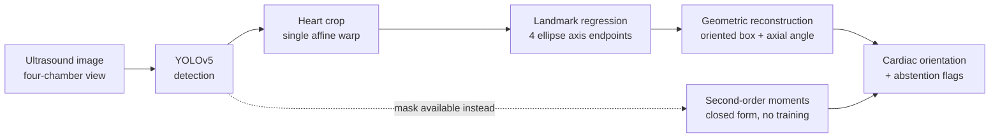

# Fetal Cardiac Orientation

> An end-to-end computer-vision pipeline that detects the fetal heart in four-chamber ultrasound images and estimates its cardiac orientation from geometric landmarks.





**Deep dive:** [docs/article.md](docs/article.md) · **Data:** [FOCUS](https://zenodo.org/records/14597550) + [FETAL_PLANES_DB](https://zenodo.org/records/3904280), CC-BY-4.0

---

## Why it is an interesting problem

A **four-chamber view** is the standard plane for screening a fetal heart. How the heart sits inside the chest in that image is a quantity clinicians measure, and it is awkward for a standard vision pipeline:

- **A box says *where*, not *at what angle*.** Axis-aligned detection throws the measurement away by construction.
- **The angle is axial.** θ and θ+180° are the same axis, so naive regression has a discontinuity inside the label space, and a near-circular object has no well-defined angle at all.
- **Fetal lie is arbitrary** — no canonical orientation, so rotation equivariance is a property the estimator must have, and one that can be tested *without labels*.

The project is organised around one question:

> **If a pipeline already localises the heart, can its orientation be read off directly — without training a network for it?**

Measured answer: **yes with a mask, no with only a box.** The boundary between those cases is the interesting part.

---

## What I built

| Stage | Method | Output |
|---|---|---|
| Detection | YOLOv5s fine-tuned on FOCUS | cardiac + thoracic boxes |
| Crop | single composed affine warp | 192×192 normalised crop |
| Landmarks | CNN coordinate regression, swap-invariant loss | 4 ellipse axis endpoints |
| Orientation | geometric reconstruction, doubled-angle vote | axial angle + oriented box |
| **Closed-form alternative** | second-order image moments | axial angle, no training |
| Evaluation | agreement stats, metamorphic tests, cross-dataset | robustness + failure analysis |

Two independent routes to the same measurement, so each checks the other.

---

## Key results

**In-distribution** (FOCUS, 50 held-out images)

| Detection | mAP@50 | mAP@50-95 | | Orientation (learned) | |
|---|---|---|---|---|---|
| cardiac | **0.995** | 0.637 | | median error | **7.04°** (CI 4.84–9.26) |
| thorax | **0.995** | 0.660 | | Bland–Altman bias | **−0.55°** |
| | 14 ms/img | | | 95 % limits of agreement | **±18°** |
| | | | | ICC(2,1) | 0.980 |

Detection is table stakes — one organ, one view, always present. The orientation model is essentially unbiased but ±18° against a clinical normal band roughly 40° wide: a working method with an honest error bar, not an instrument.

**Geometric baselines** (on masks, no training)

| Estimator | median | > 10° |
|---|---|---|
| second-order moments | **0.28°** | 0 % |
| minimum-area rectangle | 4.95° | **44 %** |

Two orders of magnitude better than the learned model — *when a mask exists*. The minimum-area rectangle is bimodal on elliptical shapes and wrong 44 % of the time. ⚠️ The 0.28° is a **floor**: those masks are rasterised from the same ellipse annotations.

**Oriented vs axis-aligned boxes** — median rotated IoU **0.83** vs **0.51**; collapsing the annotation to axis-aligned costs **×1.97 the box area**.

**External, cross-dataset** (FETAL_PLANES_DB, no labels used)

| | FOCUS | external |
|---|---|---|
| detector fires | — | **93 %** @ conf 0.75 |
| rotation ±30°, median | 3.7–4.7° | 5.3–6.5° |
| rotation ±30°, **p90** | 10.0–12.5° | **29.2–39.6°** |
| crop-scale invariance | 3.65° | **11.82°** |

**Medians move a little; the tails triple.** Works on typical external images, fails outright on a minority — a distinction an average erases.

---

## Visual results

**Oriented boxes.** Grey is what the detector is handed after the oriented annotation is collapsed to axis-aligned; teal the annotation, dashed orange reconstructed from predicted landmarks.


**What the angle is worth.** Left: area cost of dropping the angle vs orientation, with the analytic curve. Annotations cluster at 45°/135° — where a fetal heart sits in a correct four-chamber view — so the near-worst case is the ordinary case. Right: rotated IoU recovered.


**Agreement, and closed-form robustness.** Bland–Altman against the annotation; then angle error against segmentation quality — a cloud, not a curve.


**Cross-dataset behaviour, measured without labels.**


---

## The central idea: orientation need not be learned

Given a mask, the principal axis is analytic — the leading eigenvector of the pixel covariance, probability-weighted for a soft mask, in physical units:

```
C = Σ wᵢ (pᵢ − μ)(pᵢ − μ)ᵀ ,    θ = atan2(v₁ᵧ, v₁ₓ)  mod 180°
```

Closed form, differentiable, microseconds, no labels. So why train anything? Because **a detector returns a box, not a mask**. The learned model exists for that case, and keeping both makes the tradeoff explicit:

| | closed-form moments | learned landmarks |
|---|---|---|
| input | mask | box or raw crop |
| median error | 0.28° (clean masks) | 7.04° |
| out-of-distribution | no distribution to be out of | p90 triples on a second hospital |
| failure modes | geometric, enumerable | empirical, re-validate per source |

That asymmetry, more than the accuracy gap, is the argument for reading the angle off an existing segmentation whenever one exists.

**And where it breaks.** `fho.no_training` degrades masks the way segmenters fail:

| Failure mode | Dice | raw | after cleanup |
|---|---|---|---|
| erosion / dilation | 0.77 / 0.82 | 0.22° / 0.40° | **unchanged** |
| ragged contour | 0.66 | 40.20° | **1.72°** |
| chunk missing | 0.83 | 20.87° | 21.13° |
| adjacent tissue included | 0.87 | 46.21° | 44.73° |

Symmetric error is free. Two lines of cleanup (largest connected component + opening) are not optional. **Asymmetric mass survives cleanup** — that is the failure to check for in any real segmenter. And **Dice does not predict the angle error**: 0.87 → 46°, 0.77 → 0.22°.

---

## Why landmarks, not direct angle regression

Four points instead of one number buy: an **inspectable** output a reviewer can reject point by point; an **oriented box for free** (`c ± u ± v` from the axis half-vectors); and **two independent votes** — major endpoints give the axis directly, minor endpoints give it rotated 90°, a negation in doubled-angle space, so their disagreement is a confidence signal at no cost. Direction is deliberately not predicted: apex-left vs apex-right is levocardia vs dextrocardia, a diagnosis needing the spine or stomach bubble.

```
input 192×192×1
  └─ 5 × [stride-2 conv-BN-SiLU, conv-BN-SiLU]  32→256 ch   (/32 → 6×6)
      └─ AdaptiveAvgPool2d(3)          3×3 spatial grid, NOT 1×1
          └─ Linear(2304→256) + SiLU + Dropout
              ├─ coord head  Linear(256→8), tanh   → 4 × (x, y)
              └─ axis head   Linear(256→2), L2-norm → (sin 2θ, cos 2θ)
```

**Loss:** swap-invariant coordinate L1 (an ellipse is invariant under 180°, which exchanges *both* endpoint pairs, so two labellings are equally correct and any fixed convention is discontinuous — the loss scores both permutations and keeps the better one), plus an angular `1 − cos` term on the coordinate-derived axis and on the direct head. AdamW, OneCycle, 400 epochs on 200 images. Device auto-selected: MPS → CUDA → CPU.

**Augmentation follows the physics:** rotation ±180° (fetal lie is arbitrary), horizontal flip yes, **vertical flip no** (would swap near and far field — no probe does that), gain yes (varies by machine), **hue/saturation no** (grayscale), **mixup no** (blending two fetal hearts produces anatomy that does not exist).

---

## Failure analysis

Negative results are kept — they are what the experimentation produced, and what selected the design.

| Finding | Evidence | Implication |
|---|---|---|
| **Heatmap regression fails here** | 28° plateau vs 45° chance | An ellipse axis endpoint has no distinctive *local* appearance; it is defined by a global property of the shape |
| **Global average pooling harms orientation** | 21° → **4.4°** with a 3×3 grid | Pooling to 1×1 discards the spatial layout that encodes the angle |
| **Minimum-area rectangles unstable** | 44 % beyond 10° | The enclosing rectangle of an ellipse is minimal at *both* alignments: bimodal |
| **Eigengap confidence useless** | r = **+0.03** | Spurious attached mass widens the eigengap — more confident as it gets wronger |
| **Model confidence barely helps** | 53 % coverage: 7.04° → 5.40°, p90 flat | Best signal is heart size; predicted elongation is worse than nothing |
| **Crop-scale shortcut** | 3.65° → 11.82° external | Partly learned the crop convention, not the anatomy |
| **Tails, not means, degrade** | p90 10–12° → 29–40° | Report tails and covariates |
| **A sign error in the test itself** | errors of exactly 2δ | Expectations now derive from the warp matrix, not a convention |

Run against a deliberately **undertrained** checkpoint, the metamorphic suite returns rotation errors of almost exactly δ — the signature of a model predicting a constant angle regardless of input. Detecting "the model ignores the image" without ground truth is what a deployment monitor needs.

---

## Why not a rotated detector

`mmrotate` / YOLO-OBB would collapse the two stages. Reasonable, not chosen: **θ periodicity plus dataset size** (the doubled-angle encodings, circular smooth labels and Gaussian-Wasserstein losses that exist to handle it are more than 200 images support); **interpretability** (four rejectable points vs one number); and **separable failure modes** — detection transfers at 93 %, orientation degrades sharply, and one combined metric would have hidden that. Related: rotated-IoU sensitivity scales with aspect ratio, so on a near-square heart **mAP looks forgiving and hides the quantity of interest**.

---

## Reproducibility

```bash
python3 -m venv .venv && .venv/bin/pip install -r requirements.txt

make data test baselines     # FOCUS download, 9 unit tests, closed-form estimators
make yolo train              # detector, then the landmark model
make no-training             # closed-form orientation under simulated segmentation failure
make eval meta figures       # agreement stats, metamorphic suite, all figures
make data-external external  # cross-dataset run (2.1 GB download)
```

Single-image inference:

```bash
PYTHONPATH=src .venv/bin/python -m fho.predict --image path/to/scan.png
# {"angle_deg": 63.37, "roundness": 0.69, "head_disagreement_deg": 5.20, "assessable": true}
```

Verified from a clean clone in an empty environment: tests pass, data downloads, the annotation cross-check reproduces to the same 0.033°, baselines reproduce exactly, training runs on CPU as well as MPS.

```text
src/fho/
├── focus.py            dataset parsing + ellipse/oriented-box cross-validation
├── geometry.py         axial angle algebra, circular stats, PCA and min-area estimators
├── landmarks.py        single-affine crop, augmentation, canonical landmark ordering
├── model.py            landmark network + swap-invariant loss
├── train_landmarks.py  training loop, automatic device selection
├── baselines.py        closed-form estimators on ground-truth masks
├── no_training.py      simulated segmentation failure → angle-error propagation
├── evaluate.py         Bland–Altman, ICC, stratification, risk-coverage, bootstrap CIs
├── metamorphic.py      label-free equivariance and invariance tests
├── external.py         cross-dataset run, stratified by ultrasound machine
├── figures.py          every figure, regenerated from the checkpoints
└── predict.py          end-to-end detection → crop → landmarks → angle
```

---

## Limitations

- **Not a clinical cardiac-axis measurement.** That is the angle to the thoracic spine-to-sternum midline; FOCUS annotates neither spine nor septum. `geometry.cardiac_axis()` needs one more landmark.
- **±18° limits of agreement are not clinically useful** against a ~40°-wide normal band.
- **External evaluation covers self-consistency, not accuracy** — no orientation labels outside FOCUS.
- **The segmentation-failure study is simulated**, modelling failure rather than sampling a real segmenter.
- **No clinical reader ceiling**, so 7° has no reference point. 300 training images, one source.
- **Not a medical device. No clinical validation. Not for clinical use.**

---

## What I learned

- **A benchmark number can hide the failure that matters.** mAP 0.995 and an external p90 that triples describe the same model.
- **A better representation can beat a bigger model.** Moments outperform the network by two orders of magnitude where a mask exists — knowing when *not* to train is part of the job.
- **Interpretability is a choice in the prediction target**, not a post-hoc explanation.
- **Confidence estimates need empirical validation.** The theoretically motivated one scored r = +0.03; shipping it would have been worse than shipping nothing.
- **Negative experiments select architectures.** Heatmaps at 28° and global pooling at 21° are what identified the 3×3 grid.
- **Properties can be tested where labels cannot** — and the same tests keep working after deployment.

---

## Licence and citations

Code **MIT**. Both datasets are **CC-BY-4.0** and must be cited:

- *FOCUS: Four-chamber Ultrasound Image Dataset for Fetal Cardiac Biometric Measurement*, Zenodo `10.5281/zenodo.14597550`
- Burgos-Artizzu, X. P. et al., *FETAL_PLANES_DB: Common maternal-fetal ultrasound images*, Zenodo `10.5281/zenodo.3904280`

Detector built on [ultralytics/yolov5](https://github.com/ultralytics/yolov5) (AGPL-3.0), used as an external dependency and not redistributed.
