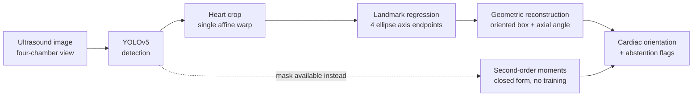

# Fetal Cardiac Orientation

> An end-to-end computer-vision pipeline that detects the fetal heart in four-chamber ultrasound images and estimates its cardiac orientation from geometric landmarks.





**Deep dive:** [docs/article.md](docs/article.md) · **Data:** [FOCUS](https://zenodo.org/records/14597550) and [FETAL_PLANES_DB](https://zenodo.org/records/3904280), both CC-BY-4.0

---

## Why this project?

A **four-chamber view** is the standard ultrasound plane used to screen a fetal heart: one image showing all four chambers, taken in every routine mid-pregnancy scan. How the heart sits inside the chest in that image — its **orientation** — is a quantity clinicians measure, and deviation from the usual range is one of the signals that prompts a closer look.

It is also a good computer-vision problem, for reasons that are not obvious:

- **Detecting the heart is not enough.** A bounding box says *where*; the measurement is *at what angle*. An axis-aligned box has thrown that away by construction.
- **Predicting the angle directly is a poor formulation.** The angle is *axial*: an axis is the same at θ and θ+180°, so a naive regression head is punished enormously at the wrap, and a near-circular object has no well-defined angle at all.
- **Fetal lie is arbitrary.** Unlike a chest radiograph there is no canonical orientation in the image, so rotation equivariance is a property the estimator genuinely must have — and one that can be tested without any labels.
- **Landmarks give an interpretable intermediate.** Predicting four points rather than one number means a reviewer can look at the output and say *that point is wrong*. An oriented box, an angle, and two consistency checks all fall out of the same four points.

The project is organised around a practical question:

> **If a pipeline already localises the heart, can its orientation be read off directly — without training a network for it?**

The measured answer is **yes when a mask is available, no when only a box is**, and the interesting part is the boundary between those two cases.

---

## What I built

| Stage | Method | Output |
|---|---|---|
| Detection | YOLOv5s fine-tuned on FOCUS | cardiac + thoracic axis-aligned boxes |
| Crop / preprocessing | single composed affine warp | 192×192 normalised heart crop |
| Landmark estimation | CNN coordinate regression, swap-invariant loss | 4 ellipse axis endpoints |
| Orientation | geometric reconstruction, doubled-angle vote | axial cardiac angle + oriented box |
| Closed-form alternative | second-order image moments (PCA) | axial angle, no training required |
| Evaluation | agreement statistics, metamorphic tests, cross-dataset | robustness and failure-mode analysis |

Two independent routes to the same measurement, so each acts as a check on the other.

---

## Key results

### In-distribution (FOCUS, 50 held-out test images)

| Detection | P | R | mAP@50 | mAP@50-95 |
|---|---|---|---|---|
| cardiac | 0.990 | **1.000** | **0.995** | 0.637 |
| thorax | 0.999 | **1.000** | **0.995** | 0.660 |

14 ms per image. Deliberately unremarkable: one organ, one view, centred, always present.

| Orientation (learned) | |
|---|---|
| median absolute error | **7.04°** (95 % CI 4.84–9.26) |
| p90 | 12.92° |
| Bland–Altman bias | **−0.55°** |
| 95 % limits of agreement | **−18.2° to +17.1°** |
| ICC(2,1) | 0.980 |

Essentially unbiased, but ±18° limits of agreement against a clinical normal band roughly 40° wide. Reported as a working method with an honest error bar, not an instrument.

### Geometric baselines (on masks, no training)

| Estimator | median error | p90 | > 10° |
|---|---|---|---|
| second-order moments (PCA) | **0.28°** | 0.45° | **0 %** |
| minimum-area rectangle | 4.95° | 88.42° | **44 %** |

The moments estimator is two orders of magnitude better than the learned model — *when a mask exists*. The minimum-area rectangle, the other obvious closed-form choice, is bimodal on elliptical shapes and wrong 44 % of the time.

> ⚠️ The FOCUS masks are rasterised from the same ellipse annotations, so 0.28° is a **floor measuring geometry-code consistency**, not accuracy on a real segmenter. The degradation study below is the informative part.

### Oriented vs axis-aligned boxes

| Box | median rotated IoU vs annotation |
|---|---|
| predicted oriented box | **0.83** |
| axis-aligned box | **0.51** |

Collapsing the oriented annotation to axis-aligned costs **×1.97 the box area** at the median.

### External, cross-dataset (FETAL_PLANES_DB, no labels used)

| | FOCUS | external |
|---|---|---|
| detector fires | — | **93 %** at conf 0.75 |
| rotation equivariance ±30°, median | 3.7–4.7° | 5.3–6.5° |
| rotation equivariance ±30°, **p90** | 10.0–12.5° | **29.2–39.6°** |
| crop-scale invariance, median | 3.65° | **11.82°** |

**Medians move a little; the tails triple.** The model still works on typical external images and fails outright on a minority — a distinction an average erases.

---

## Visual results

**Detection, landmarks and reconstructed orientation.** Best, median and worst test cases — never only the flattering ones. Solid teal is the annotation, dashed orange the prediction; filled dots are the major-axis endpoints, hollow the minor.


**Oriented boxes.** The grey rectangle is what the detector is handed after the oriented annotation is collapsed to axis-aligned; teal is the annotation, dashed orange the box reconstructed from the predicted landmarks.


**What the angle is worth.** Left: the area cost of dropping the angle, against the box's own orientation, with the analytic curve through it. The annotations cluster at 45° and 135° — where a fetal heart sits in a correct four-chamber view — so the near-worst case is the ordinary case. Right: rotated IoU recovered by the orientation head.


**Agreement, not accuracy.** Bland–Altman against the annotation, and the error distribution.


**Closed-form orientation under simulated segmentation failure.** Left: angle error against Dice — a cloud, not a curve. Right: the same data by failure mode, before and after a two-line cleanup.


**Cross-dataset behaviour, measured without labels.**


---

## The interesting technical idea

**Orientation does not have to be learned.**

If a mask of the heart exists, its principal axis is available analytically. Take the set pixels, weight them by probability if the mask is soft, convert to physical units (anisotropic pixel spacing otherwise skews the axis by the pixel aspect ratio), and take the leading eigenvector of the covariance:

```
C = Σ wᵢ (pᵢ − μ)(pᵢ − μ)ᵀ ,    θ = atan2(v₁ᵧ, v₁ₓ)  mod 180°
```

Closed form, differentiable, microseconds, no labels. On clean FOCUS masks: **0.28°**.

So why train anything? Because **a detector returns a box, not a mask**, and the moments have nothing to work on. The learned landmark model exists for exactly that case, and the project keeps both routes so the tradeoff is explicit rather than assumed:

| | closed-form moments | learned landmarks |
|---|---|---|
| input | mask | box or raw crop |
| median error | 0.28° (clean masks) | 7.04° |
| training | none | 400 epochs, 200 images |
| out-of-distribution | no distribution to be out of | p90 triples on a second hospital |
| failure modes | geometric, enumerable | empirical, must be re-validated per source |

That asymmetry — not the accuracy gap — is the real argument for reading the angle off an existing segmentation whenever one exists.

### And where the closed-form route breaks

`fho.no_training` degrades ground-truth masks the way segmenters actually fail and measures the propagation to angle error:

| Failure mode | Dice | raw mask | after cleanup |
|---|---|---|---|
| erosion (under-segmentation) | 0.77 | 0.22° | **0.22°** |
| dilation (over-segmentation) | 0.82 | 0.40° | **0.40°** |
| ragged contour | 0.66 | 40.20° | **1.72°** |
| chunk missing | 0.83 | 20.87° | 21.13° |
| adjacent tissue included | 0.87 | 46.21° | 44.73° |

Four findings:

1. **Symmetric error is free.** Eroding to Dice 0.77 costs 0.22°. Moments care how mass is *distributed*, not how thick the mask is.
2. **Two lines of cleanup are not optional.** Largest connected component + morphological opening takes a ragged contour from **40.2° to 1.7°**.
3. **Asymmetric mass survives cleanup.** A missing chunk (21°) or tissue leaking across a contiguous boundary (45°) cannot be removed by connected components. This is the failure to check for in any real segmenter.
4. **Dice does not predict the angle error.** Dice 0.87 → 46°; Dice 0.77 → 0.22°.

---

## Why landmarks instead of direct angle regression?

- **The angle is axial.** θ and θ+180° describe the same axis, so a plain regression head sees a discontinuity at the wrap. Everything here uses the **doubled-angle encoding** `(sin 2θ, cos 2θ)`, which is continuous across it, and circular statistics for aggregation.
- **Four points are inspectable.** A reviewer can reject an individual landmark. Nobody can audit a scalar.
- **Geometry falls out for free.** Centre `(p₀+p₁)/2`, half-axes `u=(p₀−p₁)/2` and `v=(p₂−p₃)/2`, corners `c ± u ± v` — an oriented bounding box from the same prediction.
- **Two independent votes.** The major endpoints give the axis directly; the minor endpoints give it rotated by 90°, which is a negation in doubled-angle space. Their disagreement is a confidence signal that costs nothing.
- **Direction is deliberately not predicted.** Apex-left versus apex-right is levocardia versus dextrocardia — a diagnosis needing the spine or stomach bubble, not something to infer from a cropped heart. The model reports an axis and leaves the sign alone.

---

## Model architecture

```
input 192×192×1
  └─ 5 × [stride-2 conv-BN-SiLU, conv-BN-SiLU]   32 → 64 → 128 → 256 → 256 ch   (/32 → 6×6)
      └─ AdaptiveAvgPool2d(3)                     3×3 spatial grid, NOT 1×1
          └─ Linear(256·9 → 256) + SiLU + Dropout(0.1)
              ├─ coord head  Linear(256 → 8), tanh, mapped into the crop   → 4 × (x, y)
              └─ axis head   Linear(256 → 2), L2-normalised                → (sin 2θ, cos 2θ)
```

**Landmark order** is `[major+, major−, minor+, minor−]`.

**Loss**, three terms:

1. **Swap-invariant coordinate L1.** An ellipse is invariant under a 180° rotation, which exchanges *both* endpoint pairs at once, so two labellings are equally correct and any fixed convention is discontinuous somewhere. The loss scores both permutations `[0,1,2,3]` and `[1,0,3,2]` and keeps the smaller per sample.
2. **Angular loss on the coordinate-derived axis**, `1 − cos` between unit vectors in doubled-angle space. Ties training to the quantity actually reported; automatically swap-invariant.
3. **Angular loss on the direct axis head**, identically defined.

**Inference.** Both axes vote, combined as unit vectors:

```
θ = ½ · atan2( sin2θ_major − sin2θ_minor ,  cos2θ_major − cos2θ_minor )
```

The reported output is the coordinate-derived angle. The direct head is never reported — it exists so the two can disagree. `predict.py` returns `assessable: false` when predicted roundness exceeds 0.93, when the two axis votes disagree by more than 12°, or when the heads disagree by more than 15°.

**Training.** AdamW, lr 3e-3, OneCycle schedule, batch 16, gradient clipping at 5.0, 400 epochs on 200 images. Device selected automatically: MPS, CUDA, or CPU.

---

## Data and experimental setup

| | FOCUS | FETAL_PLANES_DB |
|---|---|---|
| role | train + test | **external evaluation only** |
| images | 300 (200 / 50 / 50) | 12,400, of which 1,718 thorax plane |
| annotations | ellipse + oriented box + mask, for cardiac and thorax | image-level class, machine, operator |
| licence | CC-BY-4.0 | CC-BY-4.0 |
| used for | supervised training and IID metrics | label-free robustness, never trained on |

**Annotations were cross-checked before being trusted.** FOCUS stores each structure as an ellipse *and* an independently recorded oriented box. Across all 200 training images they agree to 0.07 px in centre, 0.09 px in semi-major axis, and **0.033° in angle**. That check is what licenses using the ellipse angle as ground truth — and it also pinned the convention (`a` is the semi-major axis, `theta` its direction in image coordinates with y down), which would otherwise have silently mirrored every angle in the project.

**Preprocessing.** Rotation about the heart centre and the crop are composed into a **single affine matrix**, applied to the image with `warpAffine` and to the landmarks as points, so image and labels cannot drift apart through a sign convention. Out-of-image regions fill with zeros, which is what ultrasound background is.

**Augmentation follows the physics, not the defaults:**

| | detector | landmark model | why |
|---|---|---|---|
| rotation | ±30° | ±180° | fetal lie is arbitrary |
| horizontal flip | 0.5 | 0.5 | a valid fetal lie |
| vertical flip | **off** | **off** | would swap near and far field; no probe does that |
| brightness / gain | on | on | genuinely varies between machines and operators |
| scale | ±35 % | ±12 % crop jitter | depth setting varies |
| hue / saturation | **off** | **off** | the images are grayscale |
| mixup / copy-paste | **off** | **off** | blending two fetal hearts produces anatomy that does not exist |

---

## Generalization and robustness

The project does not stop at IID test performance. Two additional layers:

**Metamorphic tests** assert properties that must hold with **no ground truth at all**:

| Property | Assertion |
|---|---|
| rotation equivariance | rotate the input by δ → the axis moves by exactly δ |
| mirror equivariance | flip left–right → the axis reflects |
| gain invariance | change brightness and contrast → the axis does not move |
| crop-scale invariance | widen the crop → the axis does not move |

All fail the tolerances set in the file, and the tolerances were **not relaxed** to make them pass. Rotation self-consistency (3–5° median) is the same order as the model's own test error, so the residual is model variance rather than a coordinate bug. **Gain invariance is violated by up to 5°** — a pure brightness change moving an anatomical measurement is a concrete, fixable defect that a test set would never have surfaced.

**Cross-dataset evaluation** runs the same suite on FETAL_PLANES_DB — different hospital, different operators, four ultrasound machines — because those properties hold on any image. The detector fires on 93 % of external thorax images, but on **81 % of Aloka** images against 95 % for Voluson E6; Aloka is 41 % of that dataset and appears nowhere in FOCUS.

The key reading is **average versus tail**: medians degrade modestly, p90s triple. Crop-scale sensitivity going from 3.7° to 11.8° says the model partly learned the FOCUS crop convention rather than the anatomy — a training-time fix, not a data problem.

---

## Failure analysis

The negative results are kept because they are what the experimentation actually produced.

| Finding | Evidence | What it means |
|---|---|---|
| **Heatmap regression fails for these landmarks** | plateaued at ~28° median, vs 45° for chance | An ellipse axis endpoint has no distinctive *local* appearance — it is defined by a global property of the shape. Heatmaps suit an apex or a valve hinge, not this. |
| **Global average pooling harms orientation** | 21° with GAP → 4.4° with a 3×3 grid | Pooling to 1×1 discards the spatial layout that encodes the angle. |
| **Minimum-area rectangles are unstable** | 44 % of clean masks beyond 10° | For an ellipse the enclosing rectangle reaches the same minimum at both the major and the minor alignment: genuinely bimodal. Exact for *area*, unstable for *axis*. |
| **The eigengap confidence does not work** | r = **+0.03** with actual error | Spurious attached mass *widens* the eigengap, so the estimator becomes more confident as it becomes wrong. |
| **The model's own confidence barely helps** | 53 % coverage moves the median 7.04° → 5.40°, p90 flat | Best available signal is simply *heart size*; predicted elongation is worse than nothing. A confidence signal that does not reduce error should not ship as one. |
| **Crop-scale sensitivity** | 3.65° → 11.82° externally | Partly learned the crop convention, not the anatomy. |
| **Tails, not means, degrade out of distribution** | p90 10–12° → 29–40° | Works on typical external images, fails outright on a minority. |
| **A sign error in the test itself** | errors of exactly 2δ on every image | The metamorphic expectation is now derived from the warp matrix, so the test has no convention of its own to get wrong. |

One extra validation that needs no labels: run the metamorphic suite against a deliberately **undertrained** checkpoint and it returns rotation errors of almost exactly δ — the signature of a model predicting a near-constant angle regardless of input. Detecting "the model ignores the image" without ground truth is exactly what a deployment monitor needs.

---

## Why not a rotated detector?

`mmrotate`, YOLO-OBB and similar predict θ inside the detector and would collapse the two stages into one. That is a reasonable design; it was not chosen here, for three reasons:

- **Angle periodicity plus dataset size.** θ modulo 180° and the near-square degeneracy need machinery — doubled-angle encodings, circular smooth labels, Gaussian-Wasserstein or KLD losses on the box as a 2-D Gaussian — that 200 training images do not support well.
- **Interpretability.** The landmark head returns four points a reviewer can reject individually; a rotated detector returns a number.
- **Separable failure modes.** Detection ("is there a heart, roughly where") transfers to a second hospital at 93 %; orientation degrades sharply out of distribution. One combined number would have hidden that. The angle *is* the measurement here, so it deserves its own metric rather than being folded into mAP.

A related consequence: **rotated-IoU metrics are really angle metrics**, and their sensitivity is set by aspect ratio. On a near-square object like a fetal heart, mAP looks forgiving and hides exactly the quantity of interest — so the angle error is reported directly.

---

## Reproducibility

```bash
python3 -m venv .venv
.venv/bin/pip install -r requirements.txt

make data test baselines     # download FOCUS, run 9 unit tests, closed-form estimators
make yolo train              # clone + patch yolov5, train detector, then the landmark model
make no-training             # closed-form orientation under simulated segmentation failure
make eval meta figures       # agreement statistics, metamorphic suite, all figures
make data-external external  # cross-dataset run on FETAL_PLANES_DB (2.1 GB download)
```

Single-image inference, end to end:

```bash
PYTHONPATH=src .venv/bin/python -m fho.predict \
    --image data/raw/FOCUS/testing/images/001.png
```

```json
{"angle_deg": 63.37, "roundness": 0.69,
 "axis_disagreement_deg": 1.60, "head_disagreement_deg": 5.20,
 "assessable": true}
```

Verified from a clean clone in an empty environment: unit tests pass, the data downloads, the annotation cross-check reproduces to the same 0.033°, the baselines reproduce exactly, and training runs on CPU as well as MPS. The training device is selected automatically (MPS → CUDA → CPU).

---

## Repository structure

```text
src/fho/
├── focus.py            dataset parsing + ellipse/oriented-box cross-validation
├── geometry.py         axial angle algebra, circular statistics, PCA and min-area estimators
├── landmarks.py        single-affine crop, augmentation, canonical landmark ordering
├── model.py            landmark network and the swap-invariant loss
├── train_landmarks.py  training loop, automatic device selection
├── baselines.py        closed-form estimators on ground-truth masks
├── no_training.py      simulated segmentation failure → angle-error propagation
├── evaluate.py         Bland–Altman, ICC, stratification, risk-coverage, bootstrap CIs
├── metamorphic.py      label-free equivariance and invariance tests
├── external.py         cross-dataset run on FETAL_PLANES_DB, stratified by machine
├── figures.py          every figure, regenerated from the checkpoints
├── prepare_yolo.py     oriented boxes → YOLO labels
└── predict.py          end-to-end detection → crop → landmarks → angle
```

---

## Limitations

Stated plainly, not buried:

- **This is not a clinical cardiac-axis measurement.** The clinical quantity is the angle between the interventricular septum and the thoracic spine-to-sternum midline. FOCUS annotates neither spine nor septum, so what is measured here is the heart's long axis in the image frame. `geometry.cardiac_axis()` is written and needs one spine landmark.
- **±18° limits of agreement are not clinically useful** against a normal band roughly 40° wide.
- **External evaluation covers self-consistency, not accuracy.** There are no orientation labels outside FOCUS.
- **No clinical reader ceiling.** Two clinicians measuring the same clip disagree by some amount, and no model beats that. Without it, 7° has no reference point.
- **The closed-form degradation study uses simulated segmentation failure**, not a real segmenter's output. The corruptions are plausible and parameterised, but they model failure rather than sample it.
- **300 training images from a single source**, no gestational-age stratification.
- **Not a medical device. No clinical validation. Not for clinical use.**

---

## What I learned

- **A benchmark number can hide the failure that matters.** mAP@50 of 0.995 and an external p90 that triples describe the same model. Reporting the tail, and the covariate it depends on, is not optional.
- **A better representation can beat a bigger model.** Second-order moments outperform the trained network by two orders of magnitude when a mask exists. Knowing when *not* to train is part of the job.
- **Interpretability is a design choice in the prediction target**, not a post-hoc explanation. Predicting four points instead of one number gave an auditable output, an oriented box, and two free consistency signals.
- **Confidence estimates need empirical validation like anything else.** The theoretically motivated eigengap error correlated with actual error at r = +0.03, and shipping it would have been worse than shipping nothing.
- **Negative experiments select architectures.** Heatmaps at 28° and global pooling at 21° were what identified the 3×3 spatial grid — the failures did the design work.
- **Properties can be tested where labels cannot.** Equivariance and invariance need no annotation, transfer to any dataset, catch bugs a held-out set cannot, and keep working as a monitor after deployment.

---

## Licence and citations

Code: **MIT**.

Both datasets are **CC-BY-4.0** and must be cited:

- *FOCUS: Four-chamber Ultrasound Image Dataset for Fetal Cardiac Biometric Measurement*, Zenodo, `10.5281/zenodo.14597550`
- Burgos-Artizzu, X. P. et al., *FETAL_PLANES_DB: Common maternal-fetal ultrasound images*, Zenodo, `10.5281/zenodo.3904280`

Detector built on [ultralytics/yolov5](https://github.com/ultralytics/yolov5) (AGPL-3.0), used as an external dependency and not redistributed here.
