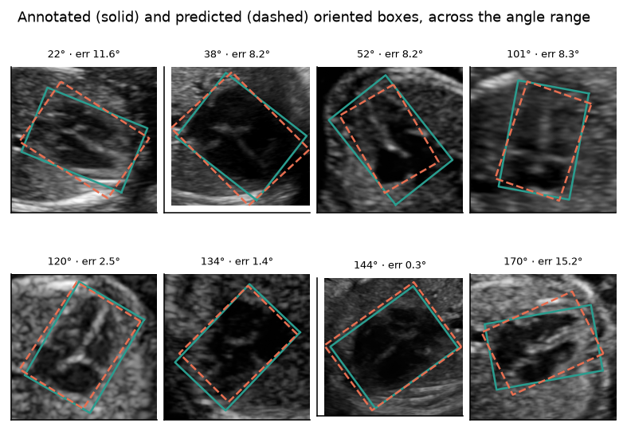

# fetal-cardiac-orientation

Estimating the orientation of the fetal heart in a four-chamber ultrasound, on public data ([FOCUS](https://zenodo.org/records/14597550) and [FETAL_PLANES_DB](https://zenodo.org/records/3904280), both CC-BY-4.0), reproducible from a clean clone.

The project is organised around one practical question:

> **If a pipeline already segments or detects the heart, can its orientation be read off directly — without training a network for it?**

The short answer is **yes, if you have a mask, and only if you know how that mask fails**. The long answer is below, with the failure modes measured rather than asserted.


Full write-up: **[docs/article.md](docs/article.md)**

## Orientation without training anything

Given a mask of the heart, the axis is available in closed form from the second-order central moments — the eigenvectors of the covariance of the set pixels, weighted by probability if the mask is soft. No training, no labels, microseconds per image. On the undamaged FOCUS masks it recovers the annotated angle to a **median of 0.28°**.

That number alone would be dishonest, because a real pipeline's mask is not an annotation. So `fho.no_training` degrades the ground-truth masks the way segmenters actually fail — systematic under- and over-segmentation, a ragged contour, a chunk missing to shadowing, neighbouring tissue leaking in — and measures how the angle error grows.


| Failure mode | Dice | raw mask | after cleanup |
|---|---|---|---|
| erosion (under-segmentation) | 0.77 | 0.22° | **0.22°** |
| dilation (over-segmentation) | 0.82 | 0.40° | **0.40°** |
| ragged contour | 0.66 | 40.20° | **1.72°** |
| chunk missing | 0.83 | 20.87° | 21.13° |
| adjacent tissue included | 0.87 | 46.21° | 44.73° |

Four things follow, and they are the useful part:

**Symmetric error is free.** Eroding or dilating a mask until Dice falls to 0.77 costs **0.22°**. Second moments do not care how thick the mask is, only how the mass is distributed, so the most common segmentation complaint is irrelevant here.

**Two lines of cleanup are not optional.** Keeping the largest connected component and morphologically opening it takes a ragged contour from **40.2° to 1.7°**. Without it, a noisy boundary destroys the estimate — and worse, adding a detached blob *widens* the eigengap, so the estimator becomes more confident as it becomes wrong.

**Asymmetric mass is the failure that survives cleanup.** A missing chunk (21°) or tissue leaking in across a contiguous boundary (45°) cannot be repaired by connected components, because the spurious mass is attached. This is the failure mode to check for in any real segmenter, and it is the one that would decide whether this approach works on someone's pipeline.

**Dice does not predict the angle error.** A mask at Dice 0.87 can give 46°; a mask at Dice 0.77 can give 0.22°. The scatter on the left of the figure is a cloud, not a curve. "Our segmenter scores 0.9" is not an answer to "will the orientation be right" — the failure mode is.

Two further cautions, stated because they cut against the method:

- **The obvious confidence signal does not work.** PCA gives a first-order standard error from the eigengap, `Var(θ) ≈ λ₁λ₂/(λ₁−λ₂)²/n`, which ought to flag ill-conditioned cases. Correlation with actual error across all corruptions: **r = +0.03**. It is fooled by exactly the failure that matters, because spurious attached mass increases the eigengap. Abstention has to come from somewhere else — a second estimator, or temporal consistency across frames.
- **The other no-training estimator is a trap.** The minimum-area enclosing rectangle, from rotating calipers on the convex hull, is exact for *area* and unstable for *axis*: for an ellipse the enclosing rectangle reaches the same minimum at both the major and the minor alignment, so it is bimodal and picks one of two optima 90° apart. Median error 4.95°, and **44 % of cases beyond 10°**, on undamaged masks. Choosing the wrong closed-form estimator costs more than not training.
- **The 0.28° figure is a floor, not evidence.** The FOCUS masks are rasterised from the same ellipse annotations, so it measures the numerical consistency of the geometry code. The degradation curves are the informative part.

## When you do need a trained model

If the pipeline returns a **box** rather than a mask, the moments have nothing to work on and the angle has to be learned. That is the rest of this repository: a YOLOv5 detector for the cardiac and thoracic regions, then a landmark-regression head that predicts the endpoints of the cardiac ellipse's axes and reconstructs the angle from them.

It is markedly worse than the closed-form route, and the numbers below say by how much.

## Does the learned model generalise? Ask without labels

The metamorphic properties an orientation estimator must satisfy — rotate the input, the axis rotates with it; change the brightness, it does not move — hold on **any** image, annotated or not. So the same suite runs unchanged on [FETAL_PLANES_DB](https://zenodo.org/records/3904280): a different hospital, four ultrasound machines, 1,718 thorax images, zero labels.

| Property | median: FOCUS → external | p90: FOCUS → external |
|---|---|---|
| rotation ±15° | 2.9–3.6° → 3.9–4.3° | 7.4–9.0° → **20.5–21.9°** |
| rotation ±30° | 3.7–4.7° → 5.3–6.5° | 10.0–12.5° → **29.2–39.6°** |
| mirror | 2.6° → 6.5° | 12.0° → **44.3°** |
| gain | 0.7° → 2.0° | 3.9° → 8.0° |
| crop scale | 3.7° → **11.8°** | 8.6° → **44.0°** |


**The medians move a little. The tails triple.** The model still works on typical external images and fails outright on a minority — a distinction any average would erase. Crop-scale sensitivity going from 3.7° to 11.8° says it partly learned the FOCUS crop convention rather than the anatomy, which is a training fix, not a data problem.

Detection transfers better: it fires on 93 % of external images at mean confidence 0.75, but on **81 % of Aloka** images against 95 % for Voluson E6. Aloka is 41 % of that dataset and appears nowhere in FOCUS.

## In-distribution numbers

Held-out test split, 50 images, trained on 200.

| Detection (YOLOv5s) | P | R | mAP@50 | mAP@50-95 |
|---|---|---|---|---|
| cardiac | 0.990 | 1.000 | 0.995 | 0.637 |
| thorax | 0.999 | 1.000 | 0.995 | 0.660 |

Table stakes: one organ, one view, centred, always present.

| Orientation | |
|---|---|
| median absolute error | 7.04° (95 % CI 4.84–9.26) |
| Bland-Altman bias | −0.55° |
| 95 % limits of agreement | −18.2° to +17.1° |
| ICC(2,1) | 0.980 |

Unbiased, and the limits of agreement are the number that counts: a single scan can be misplaced by ±18° against a clinical normal band roughly 40° wide. Validation median was 4.41°, so there is a real generalisation gap on 200 images, and training had not converged.


**Abstention does not work yet, and that is reported rather than hidden.** No internal confidence signal buys much accuracy. The best candidate is simply *heart size*; predicted elongation is worse than nothing, since abstaining by it raises the median error.


**Classical baselines** on the ground-truth masks: PCA moments 0.28° median, minimum-area rectangle 4.95° median with 44 % of cases beyond 10°. Minimum-area fails because an ellipse's enclosing rectangle hits the same minimum area at both the major and the minor alignment, so the estimator is bimodal. Exact for area, unstable for axis. (The masks are rasterised from the same ellipses, so 0.28° measures geometry-code consistency, not accuracy.)

## Run it

```bash
python3 -m venv .venv && .venv/bin/pip install -r requirements.txt
make data test baselines      # download, 9 unit tests, closed-form estimators
make yolo train               # detector, then the orientation model (~25 min, M-series GPU)
make no-training              # closed-form estimator under simulated segmentation failure
make eval meta figures        # agreement statistics, metamorphic suite, figures
make data-external external   # the external run above (2.1 GB download)
```

Device is chosen automatically: MPS, CUDA, or CPU.

## Oriented bounding boxes

An axis-aligned box has four degrees of freedom, `(x, y, w, h)`. An **oriented** box has five, `(cx, cy, w, h, θ)`, or eight if you store the corners directly — which is what FOCUS does, in the DOTA convention used by aerial-imagery detectors. That fifth number is not decoration here. It *is* the measurement: the whole point of the project is θ, and the box is just where it lives.


YOLOv5 consumes axis-aligned boxes, so stage one is handed the grey rectangle and stage two has to put the angle back. The collapse is expensive:


The left panel is the area a detector receives relative to the true oriented box, plotted against the box's own orientation, with the analytic curve `(|cos θ| + k|sin θ|)(|sin θ| + k|cos θ|)/k` for the mean aspect ratio `k = b/a = 0.73` drawn through it. The cost is zero at 0° and 90° and peaks at 45°.

**And the data sits at the peak.** The angles cluster around 45° and 135°, because that is where a fetal heart lies in a correctly obtained four-chamber view — the clinical normal cardiac axis showing up as a property of the annotation distribution. So the near-worst case is the ordinary case: the median collapse costs **×1.97** the box area, and for a tilted heart most of what the detector returns is not heart.

The right panel is what the orientation head buys back. Rotated IoU of the predicted oriented box against the annotation has a median of **0.83**; the axis-aligned box scores **0.51** against the same target, sitting right on the threshold at which most detection benchmarks stop counting a box as correct.



### Why oriented-box metrics are really angle metrics

Rotated IoU falls off with angle error at a rate set entirely by the aspect ratio:


At 1:1 the angle is meaningless and IoU barely moves — a square has no orientation, which is the same degeneracy that makes the abstention rule check for roundness. At 4:1 a 10° error already costs a quarter of the IoU and 20° breaks the 0.5 threshold. At 8:1, 10° is nearly fatal. A fetal heart sits around 1.4:1, which is why its mAP looks forgiving and why mAP is the wrong metric to optimise here: **report the angle error directly**, because an IoU number on a near-square object hides everything you care about.

### Why not train a rotated detector

`mmrotate`, YOLO-OBB and the rest predict θ inside the detector, which would collapse the two stages into one. Three reasons this project does not:

- **The angle is discontinuous.** θ is defined modulo 180°, so a naive regression head is punished enormously at the wrap, and near-square objects have no well-defined θ at all. The literature's fixes — a doubled-angle encoding, circular smooth labels, Gaussian-Wasserstein or KLD losses on the box treated as a 2-D Gaussian — all exist to work around that, and they are more machinery than a 300-image dataset can support.
- **The angle would not be inspectable.** The landmark head returns four points a clinician can reject individually. A rotated detector returns a number.
- **The stages fail differently and should be measured separately.** The detector's job is "is there a heart and roughly where", and it transfers to a second hospital at 93 % firing rate. The orientation's job is a precise geometric quantity, and it degrades sharply out of distribution. One number covering both would have hidden that.

## The landmark algorithm

Stage two regresses **four landmarks** — the endpoints of the cardiac ellipse's major and minor axes, ordered `[major+, major-, minor+, minor-]` — and reconstructs the oriented box and the angle from them. Landmarks rather than a scalar angle because the output is inspectable: a clinician can look at four points and say they are wrong, and localised evidence is worth more than a slightly better number in anything that has to be reviewed.

**Crop.** The rotation about the heart centre and the crop are composed into a **single affine matrix**, applied to the image with `warpAffine` and to the landmarks as points. Image and labels transform by the same matrix by construction, so they cannot drift apart through a sign convention. Out-of-image regions fill with zeros, which is what ultrasound background is. Output is 192×192.

**Network.** A small convolutional body (five stride-2 blocks, 32→256 channels), then a **3×3 spatial pool** rather than a global average, then a shared trunk feeding two heads:

- `coords` → 4 × 2 coordinates, `tanh`-bounded and mapped into the crop. This is the reported output.
- `axis` → the doubled angle `(sin 2θ, cos 2θ)` predicted directly. Never reported; it exists so the two heads can disagree.

**Loss.** Three terms:

1. *Swap-invariant coordinate L1.* An ellipse is invariant under a 180° rotation, which exchanges **both** endpoint pairs at once, so `[major+, major−, minor+, minor−]` and `[major−, major+, minor−, minor+]` are equally correct labellings. Any fixed convention is discontinuous somewhere, and under rotation augmentation the network then receives contradictory targets for visually identical crops. The loss scores both permutations and keeps the smaller per sample.
2. *Angular loss on the coordinate-derived axis*, as `1 − cos` between predicted and target unit vectors in the doubled-angle space. This ties training to the quantity actually reported, and doubling the angle makes it automatically invariant to the same swap.
3. *Angular loss on the direct head*, identically defined.

**Inference.** Both axes vote. The major endpoints give the axis directly; the minor endpoints give it rotated by 90°, which in the doubled-angle representation is a negation, so the two are averaged as unit vectors and converted back:

```
θ = ½·atan2( sin2θ_major − sin2θ_minor ,  cos2θ_major − cos2θ_minor )
```

Their disagreement, and the gap to the direct head, are label-free confidence signals. The four points also reconstruct the oriented box: centre `(p₀+p₁)/2`, half-axes `u = (p₀−p₁)/2` and `v = (p₂−p₃)/2`, corners `c ± u ± v`.

**Angles are axial throughout** — defined modulo 180°, aggregated with circular statistics. Direction (apex-left vs apex-right) is levocardia versus dextrocardia, a diagnosis needing the spine or stomach bubble, so it is never inferred from a cropped heart.

### Two things that had to fail first

- **Heatmap regression does not work for these landmarks.** An ellipse axis endpoint has no distinctive local appearance; it is a point on a smooth boundary defined by a global property of the shape. Heatmaps plateaued at ~28° median error against 45° for chance. Heatmaps are right for an apex or a valve hinge, wrong here.
- **Global average pooling is nearly orientation-invariant.** Pooling to 1×1 discards the spatial layout that encodes the angle. Replacing it with the 3×3 grid was the difference between plateauing at 21° and converging to 4.4°.

**Other choices, briefly.** Annotations are cross-checked before being trusted: FOCUS stores each structure as an ellipse *and* an independent oriented box, and they agree to 0.07 px and **0.033°** across all 200 training images. Augmentation follows the physics rather than the defaults — rotation ±30° because fetal lie is arbitrary, no vertical flip because no probe swaps near and far field, no hue because the images are grayscale, no mixup because blending two fetal hearts produces anatomy that does not exist.

## What this does not show

- **Not the clinical cardiac axis**, which is measured against the spine-to-sternum midline. FOCUS annotates neither spine nor septum. `geometry.cardiac_axis()` is one spine landmark away.
- **±18° limits of agreement are not clinically useful.**
- **External evaluation covers self-consistency, not accuracy** — there are no orientation labels outside FOCUS.
- **No reader ceiling**, so 7° has no reference point. No gestational-age stratification.
- **The closed-form route was tested on simulated segmentation failure, not on a real segmenter's output.** The corruptions are plausible and parameterised, but they are a model of failure, not a sample of one.
- **Not a medical device.** Not validated for clinical use.

## Layout

`src/fho/` — `focus.py` parsing and annotation cross-validation · `geometry.py` axial angle algebra, circular statistics, PCA and min-area baselines · `landmarks.py` crops and augmentation · `model.py` network and swap-invariant loss · `evaluate.py` Bland-Altman, ICC, stratification, risk-coverage · `metamorphic.py` label-free tests · `external.py` the cross-dataset run · `figures.py` · `predict.py` end to end.

## Licence

Code MIT. FOCUS and FETAL_PLANES_DB are CC-BY-4.0 and must be cited: *FOCUS: Four-chamber Ultrasound Image Dataset for Fetal Cardiac Biometric Measurement*, Zenodo `10.5281/zenodo.14597550`; Burgos-Artizzu et al., *FETAL_PLANES_DB*, Zenodo `10.5281/zenodo.3904280`.
