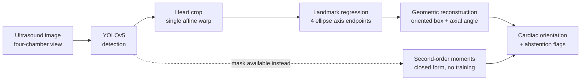
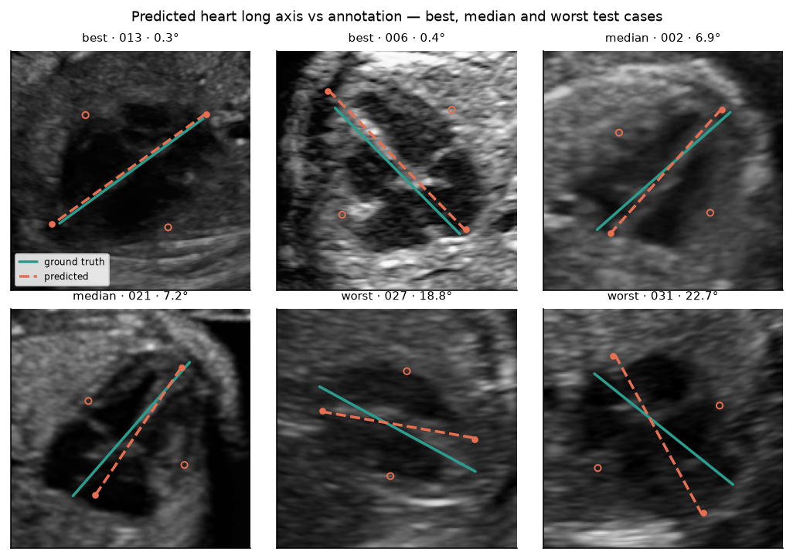
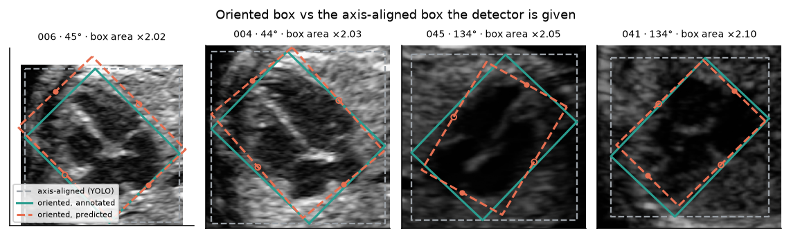
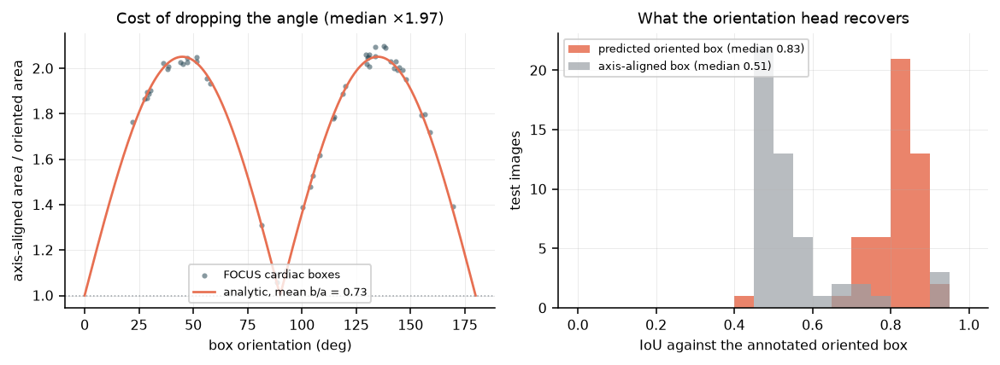
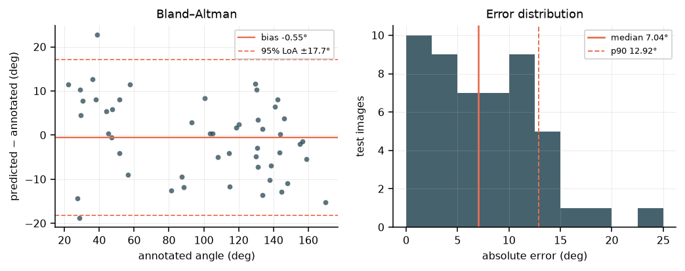
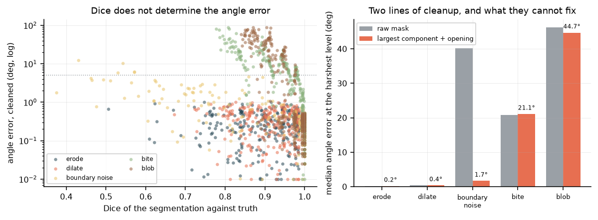
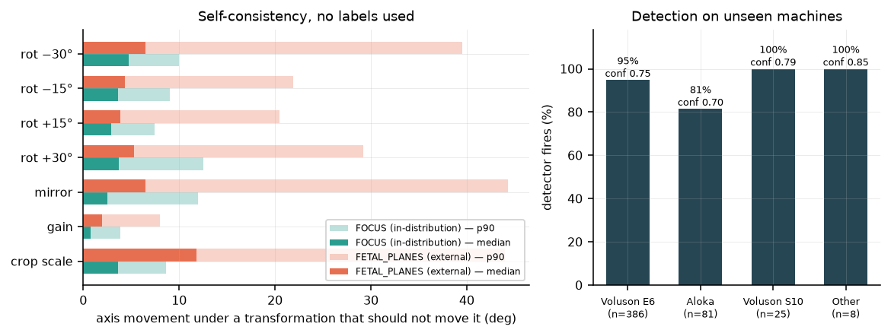

# Fetal Cardiac Orientation

> An end-to-end computer-vision pipeline that detects the fetal heart in four-chamber ultrasound images and estimates its cardiac orientation from geometric landmarks.

[](https://github.com/francescovigni/fetal-cardiac-orientation/actions/workflows/ci.yml)






**Deep dive:** [docs/article.md](docs/article.md) · **Data:** [FOCUS](https://zenodo.org/records/14597550) + [FETAL_PLANES_DB](https://zenodo.org/records/3904280), CC-BY-4.0

---

## Why it is an interesting problem

A **four-chamber view** is the standard plane for screening a fetal heart. How the heart sits inside the chest in that image is a quantity clinicians measure, and it is awkward for a standard vision pipeline:

- **A box says *where*, not *at what angle*.** Axis-aligned detection throws the measurement away by construction.
- **The angle is axial.** θ and θ+180° are the same axis, so naive regression has a discontinuity inside the label space, and a near-circular object has no well-defined angle at all.
- **Fetal lie is arbitrary** — no canonical orientation, so rotation equivariance is a property the estimator must have, and one that can be tested *without labels*.

The project is organised around one question:

> **If a pipeline already localises the heart, can its orientation be read off directly — without training a network for it?**

Measured answer: **yes with a mask, no with only a box.** The boundary between those cases is the interesting part.

---

## What I built

| Stage | Method | Output |
|---|---|---|
| Detection | YOLOv5s fine-tuned on FOCUS | cardiac + thoracic boxes |
| Crop | single composed affine warp | 192×192 normalised crop |
| Landmarks | CNN coordinate regression, swap-invariant loss | 4 ellipse axis endpoints |
| Orientation | geometric reconstruction, doubled-angle vote | axial angle + oriented box |
| **Closed-form alternative** | second-order image moments | axial angle, no training |
| Evaluation | agreement stats, metamorphic tests, cross-dataset | robustness + failure analysis |

Two independent routes to the same measurement, so each checks the other.

---

## Key results

**In-distribution** (FOCUS, 50 held-out images)

| Detection | mAP@50 | mAP@50-95 | | Orientation (learned) | |
|---|---|---|---|---|---|
| cardiac | **0.985** | 0.597 | | median error | **7.04°** (CI 4.84–9.26) |
| thorax | 0.979 | 0.545 | | Bland–Altman bias | **−0.55°** |
| | 30 ms/img | | | 95 % limits of agreement | **±18°** |
| | | | | ICC(2,1) | 0.980 |

Detection is table stakes — one organ, one view, always present. The orientation model is essentially unbiased but ±18° against a clinical normal band roughly 40° wide: a working method with an honest error bar, not an instrument.

**Geometric baselines** (on masks, no training)

| Estimator | median | > 10° |
|---|---|---|
| second-order moments | **0.28°** | 0 % |
| minimum-area rectangle | 4.95° | **44 %** |

Two orders of magnitude better than the learned model — *when a mask exists*. The minimum-area rectangle is bimodal on elliptical shapes and wrong 44 % of the time. ⚠️ The 0.28° is a **floor**: those masks are rasterised from the same ellipse annotations.

**Oriented vs axis-aligned boxes** — median rotated IoU **0.83** vs **0.51**; collapsing the annotation to axis-aligned costs **×1.97 the box area**.

Cross-dataset results have their own section below.

---

## Visual results

**Oriented boxes.** Grey is what the detector is handed after the oriented annotation is collapsed to axis-aligned; teal the annotation, dashed orange reconstructed from predicted landmarks.



**What the angle is worth.** Left: area cost of dropping the angle vs orientation, with the analytic curve. Annotations cluster at 45°/135° — where a fetal heart sits in a correct four-chamber view — so the near-worst case is the ordinary case. Right: rotated IoU recovered.



**Agreement, and closed-form robustness.** Bland–Altman against the annotation; then angle error against segmentation quality — a cloud, not a curve.




---

## Results on data the model has never seen

The model was trained on 300 images from a single source. The obvious question is whether it survives a different hospital — and the obvious obstacle is that **no other public fetal dataset carries orientation labels**.

It does not matter, because the properties an orientation estimator must satisfy hold on *any* image: rotate the input by δ and the axis must move by δ; mirror it and the axis must reflect; change brightness and the axis must not move at all. So the same test suite runs unchanged on **FETAL_PLANES_DB** — a different hospital, different operators, four ultrasound machines, **1,718 thorax-plane images, none of them trained on, none of them labelled for this task**.



### Detection transfers

**93 %** firing rate at mean confidence 0.75, on a dataset the detector has never seen. Split by manufacturer:

| Machine | share of set | detector fires | mean confidence |
|---|---|---|---|
| Voluson E6 | 77 % | **95 %** | 0.75 |
| Aloka | 16 % | **81 %** | **0.70** |
| Voluson S10 | 5 % | 100 % | 0.80 |
| Other | 2 % | 100 % | 0.85 |

Aloka is 41 % of the source dataset and appears **nowhere** in FOCUS — and it is the manufacturer where the detector is weakest, on both firing rate and confidence. That is domain shift showing up as a measurable, attributable number rather than as a caveat.

### Orientation degrades in the tail, not the median

| Property | median: FOCUS → external | p90: FOCUS → external |
|---|---|---|
| rotation ±15° | 2.9–3.6° → 3.9–4.3° | 7.4–9.0° → **20.5–21.9°** |
| rotation ±30° | 3.7–4.7° → 5.3–6.5° | 10.0–12.5° → **29.2–39.6°** |
| mirror | 2.6° → 6.5° | 12.0° → **44.3°** |
| gain | 0.7° → 2.0° | 3.9° → 8.0° |
| crop scale | 3.7° → **11.8°** | 8.6° → **44.0°** |

**The medians move modestly. The tails triple.** The model still works on typical external images and fails outright on a minority — a distinction that any mean-based summary would have erased completely. Reporting only "median error rose from 3.7° to 5.3°" would have been true and deeply misleading.

**The most specific finding is crop-scale sensitivity**, 3.7° → 11.8°. The model partly learned the FOCUS *crop convention* rather than the anatomy. That is a training-time fix — wider crop jitter — and it was found without a single annotation.

**Contrast with the closed-form route.** The moments estimator has no distribution to be out of: identical arithmetic on any mask from any machine, with failure modes that are geometric and enumerable rather than empirical. That asymmetry, more than the raw accuracy gap, is the argument for reading the angle off a segmentation whenever one exists.

---

## The central idea: orientation need not be learned

Given a mask, the principal axis is analytic — the leading eigenvector of the pixel covariance, probability-weighted for a soft mask, in physical units:

```
C = Σ wᵢ (pᵢ − μ)(pᵢ − μ)ᵀ ,    θ = atan2(v₁ᵧ, v₁ₓ)  mod 180°
```

Closed form, differentiable, microseconds, no labels. So why train anything? Because **a detector returns a box, not a mask**. The learned model exists for that case, and keeping both makes the tradeoff explicit:

| | closed-form moments | learned landmarks |
|---|---|---|
| input | mask | box or raw crop |
| median error | 0.28° (clean masks) | 7.04° |
| out-of-distribution | no distribution to be out of | p90 triples on a second hospital |
| failure modes | geometric, enumerable | empirical, re-validate per source |

That asymmetry, more than the accuracy gap, is the argument for reading the angle off an existing segmentation whenever one exists.

**And where it breaks.** `fho.no_training` degrades masks the way segmenters fail:

| Failure mode | Dice | raw | after cleanup |
|---|---|---|---|
| erosion / dilation | 0.77 / 0.82 | 0.22° / 0.40° | **unchanged** |
| ragged contour | 0.66 | 40.20° | **1.72°** |
| chunk missing | 0.83 | 20.87° | 21.13° |
| adjacent tissue included | 0.87 | 46.21° | 44.73° |

Symmetric error is free. Two lines of cleanup (largest connected component + opening) are not optional. **Asymmetric mass survives cleanup** — that is the failure to check for in any real segmenter. And **Dice does not predict the angle error**: 0.87 → 46°, 0.77 → 0.22°.

---

## Why landmarks, not direct angle regression

The model could simply output the angle. It is worth being precise about why it does not — and about what that choice costs, because it does cost something.

**The alternative was implemented and measured.** The network carries a second head that predicts the doubled angle `(sin 2θ, cos 2θ)` directly, trained jointly on the same backbone. On the same test split:

| Route | median | mean | p90 |
|---|---|---|---|
| landmarks → geometric reconstruction | 7.04° | 7.39° | 12.92° |
| **direct doubled-angle head** | **5.64°** | **6.58°** | **11.43°** |

**The direct head is slightly better.** Landmarks are not chosen for accuracy — they are chosen for four things a scalar cannot give:

1. **An inspectable output.** A reviewer can look at four points and say *that one is wrong*. Nobody can audit a number. When the estimate is off, the landmarks say *how*: a rotated axis looks different from a collapsed one, and both look different from a mislocated crop.
2. **Geometry for free.** Centre `(p₀+p₁)/2`, half-axes `u=(p₀−p₁)/2` and `v=(p₂−p₃)/2`, corners `c ± u ± v`. The oriented bounding box, the aspect ratio and the size all come out of the same prediction, with no extra head and no extra supervision.
3. **Two independent votes.** The major endpoints give the axis directly; the minor endpoints give it rotated by 90°, which is a negation in doubled-angle space. Their disagreement is a confidence signal at zero cost — and the reconstruction averages them, which is why the landmark route is the reported one.
4. **Cheap targets.** The four points are derived analytically from the ellipse annotation the dataset already ships. No extra labelling was needed to get an interpretable representation.

**And an honest caveat on the pair.** The two heads' absolute errors correlate at **r = +0.79** — they share a backbone, so they tend to fail together. That is precisely why head disagreement turns out to be a weak abstention signal (see Failure analysis), and it is an argument for a genuinely independent second estimator rather than a second head.

**Direction is deliberately not predicted.** Apex-left versus apex-right is levocardia versus dextrocardia — a diagnosis needing the spine, the stomach bubble or the descending aorta, none of which is inside a cropped heart. The system reports an axis and abstains from the sign rather than guessing it.

**Why not a rotated detector.** `mmrotate` / YOLO-OBB would predict θ inside the detector and collapse the two stages. Reasonable, not chosen: θ periodicity and the near-square degeneracy need machinery (doubled-angle encodings, circular smooth labels, Gaussian-Wasserstein losses) that 200 training images do not support; a rotated detector returns a number rather than rejectable points; and detection and orientation fail differently — detection transfers to a second hospital at 93 %, orientation degrades sharply — which one combined metric would hide. Related: rotated-IoU sensitivity scales with aspect ratio, so on a near-square heart **mAP looks forgiving and hides the quantity of interest**.

### Architecture

```
input 192×192×1
  └─ 5 × [stride-2 conv-BN-SiLU, conv-BN-SiLU]  32→256 ch   (/32 → 6×6)
      └─ AdaptiveAvgPool2d(3)          3×3 spatial grid, NOT 1×1
          └─ Linear(2304→256) + SiLU + Dropout
              ├─ coord head  Linear(256→8), tanh   → 4 × (x, y)   ← reported
              └─ axis head   Linear(256→2), L2-norm → (sin 2θ, cos 2θ)  ← consistency check
```

**Loss:** swap-invariant coordinate L1 — an ellipse is invariant under a 180° rotation, which exchanges *both* endpoint pairs, so two labellings are equally correct and any fixed convention is discontinuous somewhere; the loss scores both permutations and keeps the better one per sample. Plus an angular `1 − cos` term on the coordinate-derived axis and on the direct head. AdamW, OneCycle, 400 epochs on 200 images. Device auto-selected: MPS → CUDA → CPU.

**Augmentation follows the physics:** rotation ±180° (fetal lie is arbitrary), horizontal flip yes, **vertical flip no** (would swap near and far field — no probe does that), gain yes (varies by machine), **hue/saturation no** (grayscale), **mixup no** (blending two fetal hearts produces anatomy that does not exist).

---

## Closing the loop: a test that composes the stages

Every test above examines one stage on ground-truth inputs. This one runs the deployed path and feeds it back into itself:

```
detect  →  estimate θ  →  rotate the image so the heart is axis-aligned
        →  detect again  →  estimate θ again
```

If the first estimate were exact, the second must read zero. The residual is a label-free measure of the **composed** system, and it needs no annotation.

**It immediately found a defect that no unit-level test could see.** Re-detection after de-rotation, stratified by how much rotation the de-rotation actually applies:

| applied \|rotation\| | 0–30° | 30–45° | 45–70° | 70–91° |
|---|---|---|---|---|
| re-detected, `degrees: 30` | 100 % | 100 % | **24 %** | **0 %** |
| re-detected, `degrees: 180` | 100 % | 100 % | **100 %** | **100 %** |

Point-biserial correlation between applied rotation and re-detection, before the fix: **r = −0.75**.

**Root cause.** The detector was augmented over ±30° and the orientation model over ±180°. Each choice is defensible in isolation — but a heart sitting at 45–135° needs a rotation of up to 90° to be de-rotated, and nobody derived what stage 2 would ask of stage 1. That is a design-reasoning gap rather than a careless setting, and it is invisible until the stages are composed.

**Cost of the fix.** Retraining the detector with `degrees: 180` moves cardiac mAP@50 from 0.995 to 0.985 and re-detection from 52 % to **100 %** overall. Cheap, and the corrected value is now the shipped default.

**One trap the fix exposed.** The round-trip residual got *worse* after the fix, 8.64° → 12.80° median. It is not a regression: before, the residual could only be computed on the 52 % that re-detected — the easy, low-rotation cases. Fixing re-detection returned the hard cases to the sample. A metric degrading because the population got harder is worth catching before it is reported as a result.

**Stage attribution, for free.** A control run warps by a *random* angle and measures from the known box: residual 4.36° against 12.80° for the round trip, which uses the *re-detected* box. The gap is what stage-1 localisation variance costs the final angle — and it says the orientation model is not the dominant error term here.

⚠️ **A constant-zero estimator passes this test trivially**, since de-rotating by zero is the identity. It is a necessary condition only, meaningful alongside rotation equivariance, which a constant predictor fails by construction. There is a test named for this so it cannot be over-read.

---

## Failure analysis

Negative results are kept — they are what the experimentation produced, and what selected the design.

| Finding | Evidence | Implication |
|---|---|---|
| **Heatmap regression fails here** | 28° plateau vs 45° chance | An ellipse axis endpoint has no distinctive *local* appearance; it is defined by a global property of the shape |
| **Global average pooling harms orientation** | 21° → **4.4°** with a 3×3 grid | Pooling to 1×1 discards the spatial layout that encodes the angle |
| **Minimum-area rectangles unstable** | 44 % beyond 10° | The enclosing rectangle of an ellipse is minimal at *both* alignments: bimodal |
| **Eigengap confidence useless** | r = **+0.03** | Spurious attached mass widens the eigengap — more confident as it gets wronger |
| **Model confidence barely helps** | 53 % coverage: 7.04° → 5.40°, p90 flat | Best signal is heart size; predicted elongation is worse than nothing |
| **Crop-scale shortcut** | 3.65° → 11.82° external | Partly learned the crop convention, not the anatomy |
| **Tails, not means, degrade** | p90 10–12° → 29–40° | Report tails and covariates |
| **Stages augmented over inconsistent rotation ranges** | re-detection 100 % → 24 % → 0 % across a 45° threshold, r = −0.75 | Unit tests pass while the composed pipeline fails; derive each stage's requirements from the one downstream |
| **A sign error in the test itself** | errors of exactly 2δ | Expectations now derive from the warp matrix, not a convention |

Run against a deliberately **undertrained** checkpoint, the metamorphic suite returns rotation errors of almost exactly δ — the signature of a model predicting a constant angle regardless of input. Detecting "the model ignores the image" without ground truth is what a deployment monitor needs.

---

## Reproducibility

```bash
python3 -m venv .venv && .venv/bin/pip install -r requirements-dev.txt

make data test baselines     # FOCUS download, 9 unit tests, closed-form estimators
make yolo train              # detector, then the landmark model
make no-training             # closed-form orientation under simulated segmentation failure
make roundtrip               # closed-loop: detect → orient → de-rotate → detect → orient
make bench                   # parameters, latency and throughput for every stage
make eval meta figures       # agreement stats, metamorphic suite, all figures
make data-external external  # cross-dataset run (2.1 GB download)
```

Single-image inference:

```bash
PYTHONPATH=src .venv/bin/python -m fho.predict --image path/to/scan.png
# {"angle_deg": 63.37, "roundness": 0.69, "head_disagreement_deg": 5.20, "assessable": true}
```

**Tested in CI on every push** — Python 3.11/3.12/3.13, CPU-only, no dataset download:

| Suite | What it covers |
|---|---|
| `test_geometry.py` | axial angle algebra, circular statistics, PCA and min-area estimators |
| `test_focus.py` | annotation parsing, the semi-major convention, ellipse↔oriented-box agreement |
| `test_landmarks.py` | the composed affine crop — image and landmarks must transform together under rotation, mirroring and gain |
| `test_model.py` | forward shapes, swap-invariance of the loss, gradient reachability |
| `test_estimators.py` | moments survive symmetric mask error; cleanup rescues a detached blob but **not** attached leakage; min-area bimodality |
| `test_evaluation.py` | Bland–Altman across the 180° wrap, ICC, bootstrap, and that the metamorphic expectation is derived from the warp matrix |
| `test_pipeline_smoke.py` | YOLO label export, a two-epoch training run, and end-to-end inference |

**60 tests, all on synthetic FOCUS-shaped fixtures**, so CI never downloads the dataset and no test silently skips when the data is absent. Lint and formatting are enforced with `ruff`; documentation links are checked so a renamed figure fails the build. Tagged commits run the full suite before publishing a release.

Verified separately from a clean clone with the real data: the annotation cross-check reproduces to the same 0.033°, baselines reproduce exactly, and training runs on CPU as well as MPS.

```text
src/fho/
├── focus.py            dataset parsing + ellipse/oriented-box cross-validation
├── geometry.py         axial angle algebra, circular stats, PCA and min-area estimators
├── landmarks.py        single-affine crop, augmentation, canonical landmark ordering
├── model.py            landmark network + swap-invariant loss
├── train_landmarks.py  training loop, automatic device selection
├── baselines.py        closed-form estimators on ground-truth masks
├── no_training.py      simulated segmentation failure → angle-error propagation
├── evaluate.py         Bland–Altman, ICC, stratification, risk-coverage, bootstrap CIs
├── metamorphic.py      label-free equivariance and invariance tests
├── roundtrip.py        closed-loop consistency across both stages
├── bench.py            parameters, latency and throughput per stage
├── external.py         cross-dataset run, stratified by ultrasound machine
├── figures.py          every figure, regenerated from the checkpoints
└── predict.py          end-to-end detection → crop → landmarks → angle
```

---

## Computational cost

Measured on an M-series laptop with `make bench`, which regenerates every number below.

| Stage | Params | Latency |
|---|---|---|
| YOLOv5s detection | 7.02 M | **29.6 ms** end to end @ 640 px (14 ms of it inference; the rest letterboxing and NMS) |
| LandmarkNet | 2.95 M | **0.90 ms** GPU · 2.85 ms CPU @ 192 px · 11.8 MB of weights |
| — batch-32, CPU only | | 153 ms → **209 crops/s**, no GPU required |
| **Raw frame → angle** | ~10 M | **≈30 ms**, dominated entirely by the detector |

The closed-form route, on a full-resolution frame with a 17.7 k-pixel mask:

| Operation | This repo | OpenCV equivalent | Error |
|---|---|---|---|
| moments / PCA axis | 2.18 ms | **0.52 ms** | **0.02°** |
| cleanup (largest component + open) | 0.81 ms | — | — |
| min-area rectangle | 72.6 ms | **0.64 ms** | **90.00°** |

**Orientation from an existing mask costs ≈1.3 ms** — around 1 % of what the segmentation that produced the mask already cost. The cost argument and the accuracy argument point the same way: the closed-form route is both two orders of magnitude more accurate on clean masks and an order of magnitude cheaper.

Two implementation notes, so the table is not misread:

- **The min-area gap is mine, not the algorithm's.** `geometry.py` deliberately imports no cv2, so its convex hull is a pure-Python monotone chain written for clarity. Rotating calipers is not inherently expensive — `cv2.minAreaRect` does it in 0.64 ms. It still loses on accuracy, and the benchmark demonstrates it live: **exactly 90.00° of error on this ellipse**, the bimodality described above, reproduced every run.
- **The PCA gap buys something.** `cv2.moments` is 4× faster on a hard binary mask, but takes neither probability weights for a soft mask nor physical pixel spacing. Both matter here, so 0.52 ms is the floor, not a free win.

**Training cost, in total:** the detector is ~25–30 min for 150 epochs and the landmark model ~12–15 min for 400, both on 200 images on a laptop. **The entire project trains in under an hour with no cloud and no rented GPU.** The largest single cost is the 2.1 GB external dataset download.

**For deployment**, 30 ms/frame sits inside real-time for ultrasound at 30–60 fps, and the 2.85 ms CPU figure matters more than the GPU one: the orientation head needs no accelerator at all, so on-device is plausible before any quantisation or pruning.

---

## Limitations

- **Not a clinical cardiac-axis measurement.** That is the angle to the thoracic spine-to-sternum midline; FOCUS annotates neither spine nor septum. `geometry.cardiac_axis()` needs one more landmark.
- **±18° limits of agreement are not clinically useful** against a ~40°-wide normal band.
- **External evaluation covers self-consistency, not accuracy** — no orientation labels outside FOCUS.
- **The segmentation-failure study is simulated**, modelling failure rather than sampling a real segmenter.
- **No clinical reader ceiling**, so 7° has no reference point. 300 training images, one source.
- **Not a medical device. No clinical validation. Not for clinical use.**

---

## What I learned

- **A benchmark number can hide the failure that matters.** mAP 0.995 and an external p90 that triples describe the same model.
- **A better representation can beat a bigger model.** Moments outperform the network by two orders of magnitude where a mask exists — knowing when *not* to train is part of the job.
- **Interpretability is a choice in the prediction target**, not a post-hoc explanation.
- **Confidence estimates need empirical validation.** The theoretically motivated one scored r = +0.03; shipping it would have been worse than shipping nothing.
- **Negative experiments select architectures.** Heatmaps at 28° and global pooling at 21° are what identified the 3×3 grid.
- **Compose the stages before trusting either.** Both passed their own tests while the pipeline asked the detector for rotations it was never trained on. The bug only existed in the seam.
- **Properties can be tested where labels cannot** — and the same tests keep working after deployment.

---

## Licence and citations

Code **MIT**. Both datasets are **CC-BY-4.0** and must be cited:

- *FOCUS: Four-chamber Ultrasound Image Dataset for Fetal Cardiac Biometric Measurement*, Zenodo `10.5281/zenodo.14597550`
- Burgos-Artizzu, X. P. et al., *FETAL_PLANES_DB: Common maternal-fetal ultrasound images*, Zenodo `10.5281/zenodo.3904280`

Detector built on [ultralytics/yolov5](https://github.com/ultralytics/yolov5) (AGPL-3.0), used as an external dependency and not redistributed.
