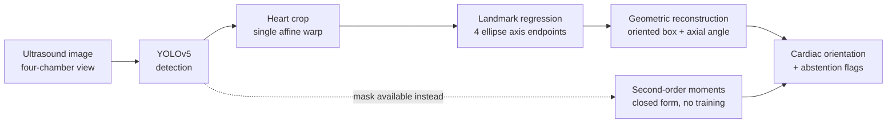
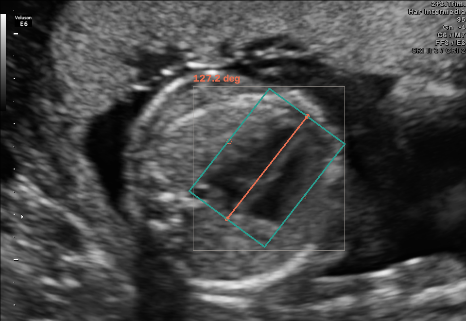

# Fetal Cardiac Orientation

> An end-to-end computer-vision pipeline that detects the fetal heart in four-chamber ultrasound images and estimates its cardiac orientation from geometric landmarks.

[](https://github.com/francescovigni/fetal-cardiac-orientation/actions/workflows/ci.yml)





**Deep dive:** [docs/article.md](docs/article.md) · **Data:** [FOCUS](https://zenodo.org/records/14597550) + [FETAL_PLANES_DB](https://zenodo.org/records/3904280), CC-BY-4.0

---

## In one paragraph

How tilted the heart sits in the chest is a quantity clinicians measure on the standard four-chamber scan, and an unusual tilt is one of the signals that prompts a closer look. This estimates it two ways and compares them. The main result is that **you mostly do not need a neural network for it**: if something already outlines the heart, the tilt follows from basic geometry, two orders of magnitude more accurately and an order of magnitude cheaper than the model trained to do the same job. The useful part is knowing when that shortcut breaks — and it does not break where the usual quality score says it should.

---

## How it works

### 1. Detection — YOLOv5s

Fine-tuned on 200 images to find the cardiac and thoracic regions. Held-out test split:

| Detector | class | P | R | mAP@50 | mAP@50-95 |
|---|---|---|---|---|---|
| `degrees: 30` (original) | cardiac | 0.990 | 1.000 | **0.995** | 0.637 |
| `degrees: 180` (**shipped**) | cardiac | 0.974 | 0.980 | **0.985** | 0.597 |
| `degrees: 180` (shipped) | thorax | 0.980 | 0.975 | 0.979 | 0.545 |

The shipped detector is slightly worse on paper and correct in the pipeline — see [Closing the loop](#closing-the-loop). Two numbers that matter more than mAP: on a **different hospital's data** it fires on **93 %** of thorax images at 0.75 confidence, and it runs in 29.6 ms per image.

Read the mAP as table stakes. One organ, one view, centred, always present — anything below ~0.98 would indicate a labelling problem, not a modelling one.

### 2. What happens next

Take the highest-confidence cardiac box → expand by 35 % → build **one** affine matrix composing any rotation with the crop → warp to 192×192, applying the same matrix to the image and to the landmarks so they cannot drift apart → landmark network → 4 points → reconstruct the angle and the oriented box geometrically → emit abstention flags.

Both axes vote in the reconstruction: the major endpoints give the axis directly, the minor endpoints give it rotated by 90°, which is a negation in doubled-angle space, so the two average as unit vectors. The oriented box is `c ± u ± v` from the half-axis vectors.

### 3. The landmark model

Yes, a model was trained: 400 epochs on 200 images, 12–15 min on a laptop. **No manual annotation was needed** — the four landmark targets are derived analytically from the ellipse annotations the dataset already ships, which is how you get an interpretable representation for free.

```
input 192×192×1                                          2.95 M params · 11.8 MB
  └─ 5 × [stride-2 conv-BN-SiLU, conv-BN-SiLU]   32→64→128→256→256   (/32 → 6×6)
      └─ AdaptiveAvgPool2d(3)        ← 3×3 grid, NOT global average
          └─ Linear(2304→256) + SiLU + Dropout(0.1)
              ├─ coord head  Linear(256→8), tanh     → 4 × (x,y)      [reported]
              └─ axis head   Linear(256→2), L2-norm  → (sin2θ, cos2θ) [consistency check]
```

**Loss, three terms.** A swap-invariant coordinate L1 — an ellipse is invariant under a 180° rotation, which exchanges *both* endpoint pairs, so two labellings are equally correct and any fixed convention is discontinuous; the loss scores both permutations and keeps the better one per sample. Plus `1 − cos` angular terms on the coordinate-derived axis and on the direct head. AdamW, lr 3e-3, OneCycle, batch 16.

**Two architecture choices came from measured failures.** Heatmap regression plateaued at 28° (an ellipse axis endpoint has no distinctive *local* appearance — it is defined by a global property of the shape). Global average pooling plateaued at 21° (it discards the spatial layout that encodes the angle). The 3×3 grid is what fixed it.

### 4. Why landmarks rather than a scalar angle

The alternative was implemented and measured — the second head predicts the angle directly:

| Route | median | p90 |
|---|---|---|
| landmarks → geometric reconstruction | 7.04° | 12.92° |
| **direct doubled-angle head** | **5.64°** | **11.43°** |

The direct head is slightly *better*, so landmarks are not justified by accuracy. They are justified by an output a reviewer can reject point by point, an oriented box and aspect ratio for free, and two votes whose disagreement is a confidence signal. Caveat: the two heads' errors correlate at **r = +0.79** — they share a backbone and fail together, which is why head disagreement is a weak abstention signal.

**Direction is deliberately not predicted.** Apex-left versus apex-right is levocardia versus dextrocardia — a diagnosis needing the spine or stomach bubble, not something to infer from a cropped heart.

---

## Key results

**Orientation, learned route** (50 held-out images):

| | |
|---|---|
| median absolute error | **7.04°** (95 % CI 4.84–9.26) |
| Bland–Altman bias | **−0.55°** |
| 95 % limits of agreement | **±18°** |
| ICC(2,1) | 0.980 |

Essentially unbiased, but ±18° against a clinical normal band roughly 40° wide. A working method with an honest error bar, not an instrument.


**Geometric baselines** (on masks, no training): second-order moments **0.28°** median, 0 % beyond 10°. Minimum-area rectangle 4.95° median, **44 % beyond 10°** — it is bimodal on elliptical shapes. ⚠️ The 0.28° is a **floor**: those masks are rasterised from the same ellipse annotations.

**Oriented vs axis-aligned boxes:** median rotated IoU **0.83** vs **0.51**. Collapsing the annotation to axis-aligned costs **×1.97 the box area**, and the annotations cluster at 45°/135° — where a fetal heart sits in a correct four-chamber view — so the near-worst case is the ordinary case.


---

## Orientation need not be learned

Given a mask, the principal axis is analytic — the leading eigenvector of the pixel covariance, probability-weighted for a soft mask, in physical units:

```
C = Σ wᵢ (pᵢ − μ)(pᵢ − μ)ᵀ ,    θ = atan2(v₁ᵧ, v₁ₓ)  mod 180°
```

Closed form, ~1.3 ms, no labels. The learned model exists only because **a detector returns a box, not a mask**.

| | closed-form moments | learned landmarks |
|---|---|---|
| input | mask | box or raw crop |
| median error | 0.28° (clean masks) | 7.04° |
| out-of-distribution | no distribution to be out of | p90 triples on a second hospital |
| failure modes | geometric, enumerable | empirical, re-validate per source |

**And where it breaks.** `fho.no_training` degrades masks the way segmenters fail:

| Failure mode | Dice | raw | after cleanup |
|---|---|---|---|
| erosion / dilation | 0.77 / 0.82 | 0.22° / 0.40° | **unchanged** |
| ragged contour | 0.66 | 40.20° | **1.72°** |
| chunk missing | 0.83 | 20.87° | 21.13° |
| adjacent tissue included | 0.87 | 46.21° | 44.73° |


Symmetric error is free. Two lines of cleanup — largest connected component plus opening — are not optional. **Asymmetric mass survives cleanup**, and that is the failure to check for in any real segmenter. **Dice does not predict the angle error**: 0.87 → 46°, 0.77 → 0.22°.

---

## Results on data the model has never seen

No other public fetal dataset carries orientation labels. It does not matter, because the properties an orientation estimator must satisfy hold on *any* image — rotate the input by δ and the axis must move by δ; change brightness and it must not move at all. So the same suite runs unchanged on **FETAL_PLANES_DB**: a different hospital, four ultrasound machines, 1,718 thorax images, none trained on, none labelled.


| Property | median: FOCUS → external | p90: FOCUS → external |
|---|---|---|
| rotation ±30° | 3.7–4.7° → 5.3–6.5° | 10.0–12.5° → **29.2–39.6°** |
| mirror | 2.6° → 6.5° | 12.0° → **44.3°** |
| crop scale | 3.7° → **11.8°** | 8.6° → **44.0°** |

**The medians move a little. The tails triple.** The model works on typical external images and fails outright on a minority — a distinction any average erases. Crop-scale sensitivity rising to 11.8° says it partly learned the FOCUS *crop convention* rather than the anatomy. By machine: 95 % detector firing on Voluson E6, **81 % on Aloka** — 41 % of that dataset, and absent from FOCUS entirely.

---

## Closing the loop

Every test above examines one stage on ground-truth inputs. This one runs the deployed path and feeds it back into itself: `detect → estimate θ → rotate the image so the heart is axis-aligned → detect again → estimate again`. If the first estimate were exact, the second must read zero.

**It found a defect no unit-level test could see:**

| applied \|rotation\| | 0–30° | 30–45° | 45–70° | 70–91° |
|---|---|---|---|---|
| re-detected, `degrees: 30` | 100 % | 100 % | **24 %** | **0 %** |
| re-detected, `degrees: 180` | 100 % | 100 % | **100 %** | **100 %** |

Correlation between applied rotation and re-detection before the fix: **r = −0.75**. The detector was augmented over ±30° and the orientation model over ±180°; a heart at 45–135° needs up to 90° of rotation to be de-rotated. Each choice is defensible alone — nobody derived what the downstream stage would demand. The fix costs 0.995 → 0.985 cardiac mAP@50 and takes re-detection from 52 % to **100 %**.

**The residual got *worse* after the fix**, 8.64° → 12.80°. Not a regression: before, it could only be computed on the 52 % that re-detected, the easy cases. Repairing re-detection returned the hard ones to the sample.

⚠️ A constant-zero estimator passes this test trivially, so it is a **necessary condition only**, meaningful alongside rotation equivariance. A test is named after that limitation so it cannot be over-read.

---

## Failure analysis

Negative results are kept — they are what selected the design.

| Finding | Evidence | Implication |
|---|---|---|
| **Heatmap regression fails here** | 28° plateau vs 45° chance | Axis endpoints have no distinctive *local* appearance |
| **Global average pooling harms orientation** | 21° → **4.4°** with a 3×3 grid | Pooling to 1×1 discards the spatial layout encoding the angle |
| **Minimum-area rectangles unstable** | 44 % beyond 10° | An ellipse's enclosing rectangle is minimal at *both* alignments |
| **Eigengap confidence useless** | r = **+0.03** | Attached spurious mass widens the eigengap — more confident as it gets wronger |
| **Model confidence barely helps** | 53 % coverage: 7.04° → 5.40°, p90 flat | Best signal is heart size; predicted elongation is worse than nothing |
| **Stages augmented inconsistently** | re-detection 100 → 24 → 0 % across a 45° threshold | Unit tests pass while the composed pipeline fails |
| **Crop-scale shortcut** | 3.65° → 11.82° external | Partly learned the crop convention, not the anatomy |
| **A sign error in the test itself** | errors of exactly 2δ | Expectations now derive from the warp matrix, not a convention |

Run against a deliberately **undertrained** checkpoint, the metamorphic suite returns rotation errors of almost exactly δ — the signature of a model predicting a constant angle regardless of input. Detecting "the model ignores the image" without ground truth is what a deployment monitor needs.

---

## Computational cost

Measured with `make bench`, which regenerates every number.

| Stage | Params | Latency |
|---|---|---|
| YOLOv5s detection | 7.02 M | **29.6 ms** end to end @ 640 px (14 ms of it inference) |
| LandmarkNet | 2.95 M | **0.90 ms** GPU · 2.85 ms CPU · **209 crops/s** batched on CPU alone |
| **Raw frame → angle** | ~10 M | **≈30 ms**, dominated entirely by the detector |
| **Existing mask → angle** | 0 | **≈1.3 ms** — about 1 % of the segmentation that produced the mask |

Cost and accuracy point the same way: the closed-form route is both far more accurate on clean masks and an order of magnitude cheaper.

Two notes so the table is not misread. The min-area gap is *mine*, not the algorithm's — `geometry.py` imports no cv2, so its convex hull is pure Python at 72.6 ms against `cv2.minAreaRect`'s 0.64 ms; rotating calipers is not slow, it just loses on accuracy, and the benchmark reproduces that live with **exactly 90.00° of error** on the reference ellipse. And the PCA gap buys something: `cv2.moments` is 4× faster but takes neither probability weights nor physical pixel spacing.

**The whole project trains in under an hour on a laptop** — detector ~25–30 min, landmark model ~12–15 min, no cloud, no rented GPU.

---

## Reproducibility

```bash
python3 -m venv .venv && .venv/bin/pip install -r requirements-dev.txt

make weights demo            # trained checkpoints + a working example, no training
make data test baselines     # FOCUS download, unit tests, closed-form estimators
make yolo train              # detector, then the landmark model
make no-training roundtrip   # segmentation-failure study, closed-loop consistency
make eval meta figures bench # agreement stats, metamorphic suite, figures, cost
make data-external external  # cross-dataset run (2.1 GB download)
```

**Try it in 30 seconds, without training anything:**

```bash
make demo     # fetches the checkpoints from the latest release, runs on a bundled sample
```



```json
{"angle_deg": 127.24, "roundness": 0.69,
 "axis_disagreement_deg": 1.32, "head_disagreement_deg": 3.39, "assessable": true}
```

The bundled image is a **median case, not a showcase**: annotated 138.6°, predicted
127.2° end to end — see [docs/sample](docs/sample/) for why that image was chosen and
what the 4.5° difference between the end-to-end and ground-truth-crop predictions
attributes to stage 1.

Any other image:

```bash
PYTHONPATH=src .venv/bin/python -m fho.predict --image path/to/scan.png --save out.png
```

**Tested in CI on every push** — Python 3.11/3.12/3.13, CPU-only, **63 tests on synthetic FOCUS-shaped fixtures** so nothing downloads and no test silently skips when the data is absent. Coverage spans annotation parsing, the affine crop's image/landmark consistency, swap-invariance of the loss, the estimators' characteristic failure modes, agreement statistics across the 180° wrap, and a two-epoch training run. `ruff` enforces lint and formatting; a link checker fails the build on a renamed figure; tagged commits gate a release on the full suite.

```text
src/fho/
├── focus.py            dataset parsing + ellipse/oriented-box cross-validation
├── geometry.py         axial angle algebra, circular stats, PCA and min-area estimators
├── landmarks.py        single-affine crop, augmentation, canonical landmark ordering
├── model.py            landmark network + swap-invariant loss
├── train_landmarks.py  training loop, automatic device selection
├── baselines.py        closed-form estimators on ground-truth masks
├── no_training.py      simulated segmentation failure → angle-error propagation
├── evaluate.py         Bland–Altman, ICC, stratification, risk-coverage, bootstrap CIs
├── metamorphic.py      label-free equivariance and invariance tests
├── roundtrip.py        closed-loop consistency across both stages
├── external.py         cross-dataset run, stratified by ultrasound machine
├── bench.py            parameters, latency and throughput per stage
├── figures.py          every figure, regenerated from the checkpoints
└── predict.py          end-to-end detection → crop → landmarks → angle
```

---

## Limitations

- **Not a clinical cardiac-axis measurement.** That is the angle to the thoracic spine-to-sternum midline; FOCUS annotates neither spine nor septum. `geometry.cardiac_axis()` needs one more landmark.
- **±18° limits of agreement are not clinically useful** against a ~40°-wide normal band.
- **External evaluation covers self-consistency, not accuracy** — no orientation labels outside FOCUS.
- **The segmentation-failure study is simulated**, modelling failure rather than sampling a real segmenter.
- **No clinical reader ceiling**, so 7° has no reference point. 300 training images, one source.
- **Not a medical device. No clinical validation. Not for clinical use.**

---

## What I learned

- **A benchmark number can hide the failure that matters.** mAP 0.985 and an external p90 that triples describe the same model.
- **A better representation can beat a bigger model.** Moments outperform the network by two orders of magnitude where a mask exists — knowing when *not* to train is part of the job.
- **Compose the stages before trusting either.** Both passed their own tests while the pipeline asked the detector for rotations it had never seen. The bug existed only in the seam.
- **Confidence estimates need empirical validation.** The theoretically motivated one scored r = +0.03; shipping it would have been worse than shipping nothing.
- **Negative experiments select architectures.** Heatmaps at 28° and global pooling at 21° are what identified the 3×3 grid.
- **Properties can be tested where labels cannot** — and the same tests keep working after deployment.

---

## Licence and citations

Code **MIT**. Both datasets are **CC-BY-4.0** and must be cited:

- *FOCUS: Four-chamber Ultrasound Image Dataset for Fetal Cardiac Biometric Measurement*, Zenodo `10.5281/zenodo.14597550`
- Burgos-Artizzu, X. P. et al., *FETAL_PLANES_DB: Common maternal-fetal ultrasound images*, Zenodo `10.5281/zenodo.3904280`

Detector built on [ultralytics/yolov5](https://github.com/ultralytics/yolov5) (AGPL-3.0), used as an external dependency and not redistributed.
