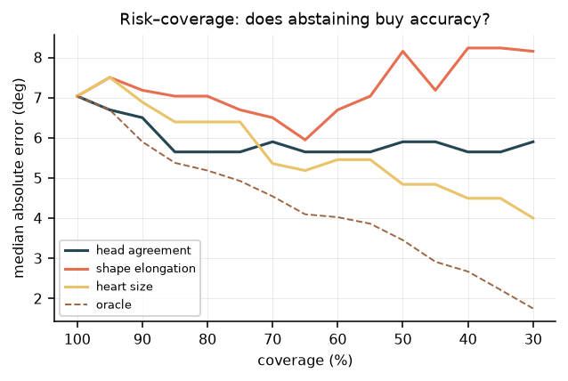

# Estimating fetal cardiac orientation, and knowing when it is wrong

Find the heart in a prenatal four-chamber scan, then estimate its long axis. The detection half took an afternoon and is not interesting. The estimation half failed three times for reasons worth writing down, still is not accurate enough to measure anything clinically, and — this is the part I would keep — can be tested on a second hospital's data that has no orientation labels at all.

**Code:** [github.com/francescovigni/fetal-cardiac-orientation](https://github.com/francescovigni/fetal-cardiac-orientation) · **Data:** [FOCUS](https://zenodo.org/records/14597550) and [FETAL_PLANES_DB](https://zenodo.org/records/3904280), both CC-BY-4.0

| | |
|---|---|
| Detects the fetal heart and thorax | mAP@50 **0.995**, recall 1.00, 14 ms/image |
| Estimates the heart's long axis | median error **7.0°**, 95 % limits of agreement **±18°** |
| Measures the clinical cardiac axis | **No.** That needs a spine landmark this dataset lacks |
| Knows when it is wrong | **Not yet.** The abstention signals barely reduce error |

The clinical normal band for cardiac axis is roughly 40° wide, so ±18° is nearly half of it. A working method with an honest error bar, not an instrument.

## Why it is harder than it looks

Cardiac axis is the angle between the interventricular septum and the thoracic anteroposterior midline. It sits near 45° normally, and deviation is an independent screening marker for congenital heart disease.

Three properties make it awkward. It is **a difference of two angles**, and the thoracic reference is usually the noisier term, so an error budget that ignores it is optimistic. It is **axial, not directional**: an axis is defined modulo 180°, and turning it into a direction is levocardia versus dextrocardia, a diagnosis that needs the spine or the stomach bubble rather than a cropped heart. And **fetal lie is arbitrary**, so unlike a chest radiograph there is no canonical orientation, which makes rotation equivariance a property the model genuinely must have.

## Checking the annotations before trusting them

[FOCUS](https://zenodo.org/records/14597550) is 300 prenatal four-chamber images, 200/50/50. Each carries three parallel annotations for cardiac and thorax: an ellipse, an oriented box, and a mask. A public fetal dataset shipping native oriented boxes is unusual and is what made the project possible.

Before using the ellipse angle as ground truth I checked it against the independently stored oriented box across all 200 training images: centre agrees to 0.07 px, semi-major to 0.09 px, angle to **0.033°**. That is thirty lines of code, and it is the difference between "the annotations are consistent" and "I assume they are". It also pinned the convention — `a` is the semi-major axis, `theta` its direction in image coordinates with y pointing down. Getting that wrong would have silently mirrored every angle in the project.

Detection is table stakes and I will not dwell on it: one organ, one view, centred, always present, mAP@50 0.995 on both classes. The transferable part is the augmentation policy, which follows the physics rather than the defaults — rotation because fetal lie is arbitrary, no vertical flip because no probe swaps near and far field, no hue on grayscale, no mixup because blending two fetal hearts produces anatomy that does not exist.

## Three failures, in order

The orientation head regresses four landmarks, the endpoints of the cardiac ellipse's axes, and derives the axis from them. Landmarks rather than a scalar because the output is inspectable: a clinician can look at four points and say they are wrong, and nobody can audit a number. The [README](../README.md#the-landmark-algorithm) has the full algorithm. Three things had to fail first.

**The 180° endpoint swap.** An ellipse is invariant under a 180° rotation, and that rotation exchanges both pairs of endpoints at once. Two labellings are equally correct, so any fixed convention is discontinuous somewhere, and under rotation augmentation the network receives contradictory targets for visually identical crops. It cannot learn. The fix is a loss that scores both assignments and keeps the better one per sample — the landmark analogue of encoding an axial angle as `(sin 2θ, cos 2θ)`, which cures the same disease in oriented-box regression.

**Heatmaps are the wrong estimator for these landmarks.** The first version used per-landmark Gaussian heatmaps, the default choice, and plateaued at about 28° median error against 45° for random guessing on axial data. An ellipse axis endpoint has no distinctive local appearance: it is a point on a smooth boundary, defined by a global property of the shape, and a receptive field centred on it sees what it would see a few pixels along the contour. Heatmaps work when a landmark has local evidence — an apex, a valve hinge, a vertebral body. These have none.

**Global average pooling is almost orientation-invariant.** Pooling the final feature map to 1×1 discards the spatial layout, and the spatial layout is where the angle lives. Obvious in hindsight, and the last thing I looked at.

Measured on the same validation split: heatmaps 28°, global regression with average pooling 21°, global regression with a 3×3 spatial grid 4.4°.

## Results, read honestly

Test split, 50 images, 400 epochs on 200 training images.

```
median |error|     7.04°   95 % CI [4.84, 9.26]
p90    |error|    12.92°
Bland-Altman       bias -0.55°   LoA [-18.23, +17.12]
ICC(2,1)           0.980
```


Four numbers saying four different things. The **bias of −0.55°** means no systematic rotation error, the failure that would matter most clinically and the one a mean absolute error hides. The **ICC of 0.980** is the flattering one: cardiac angles span a wide range and ICC rewards tracking it, so quoted alone it misleads. The **limits of agreement, ±18°**, are what a clinician would actually ask for. And the gap between **4.41° on validation and 7.04° on test**, with a bootstrap interval of [4.84, 9.26], says both that there is a real generalisation gap on 200 images and that the test estimate itself is loose. Training had not converged at 400 epochs.


Stratifying says more than the headline. By roundness, 6.70° for `b/a` in 0.60–0.75 against 7.93° for 0.75–0.90 — rounder is harder, as the geometry predicts. By size, 9.26° at 90–120 px semi-major against 4.93° above 120 px. The size effect is the larger of the two: a few pixels of landmark error is several degrees on a small heart. That is the resolution argument appearing in data rather than in a paragraph.

### The abstention signals do not work, and that is a result

The model carries two internal consistency checks: the major and minor axes each vote for the angle, and a second head predicts it directly. Both disagreements are free confidence signals.



Neither buys much. Dropping to 53 % coverage moves the median from 7.04° to 5.40°, and the p90 barely moves. The best signal available is not either of them — it is simply **heart size**. Predicted elongation is worse than nothing: abstaining by it makes the median error rise. A confidence signal that does not reduce error is not a confidence signal, and shipping it as one would be worse than having none.

## Validating without labels

A held-out set is not the only instrument, and on 50 images it is a blunt one. Four properties can be asserted with no ground truth at all: rotate the input by δ and the axis must move by δ; mirror it and the axis must reflect; change brightness and contrast and the axis must not move, because neither is anatomy; widen the crop and it must not move.

```
rotation equivariance ±15°   median 2.9–3.6°   p90  7.4–9.0°
rotation equivariance ±30°   median 3.7–4.7°   p90 10.0–12.5°
mirror equivariance          median 2.55°      p90 12.00°
gain invariance              median 0.74°      p90  3.90°   max 5.31°
crop-scale invariance        median 3.65°      p90  8.63°
```

Every one fails the tolerances set in the file. The tolerances were not relaxed to make them pass. Rotation self-consistency, 3° to 5°, is the same order as the model's own test error, so the residual is model variance rather than a coordinate bug. **Gain invariance is violated by up to 5°**: a pure brightness change moves an anatomical measurement, which points at stronger intensity augmentation and is not something a test set would ever have said.

The suite earned its place twice. The first run reported errors of exactly twice the applied rotation on every image, and errors of exactly 2δ are the signature of a flipped sign — which was in the test's own expected value. The expectation is now derived from the warp matrix itself, so the test has no convention left to get wrong. Then, run against a deliberately undertrained checkpoint, it gives rotation errors of almost exactly δ: the signature of a model predicting a near-constant angle regardless of input. Detecting "the model ignores the image" with no labels is what you want running as a monitor in production, where labels never arrive.

## Testing it somewhere else, with no labels

The obvious objection is that this is 300 images from one source. The obvious answer is an external set, and the obvious obstacle is that orientation ground truth does not exist outside FOCUS.

It does not matter, because those four properties hold on any image. The same code runs unchanged on [FETAL_PLANES_DB](https://zenodo.org/records/3904280): a different hospital, different operators, four ultrasound machines, 1,718 images of the thorax plane.

The detector fires on **93 %** of them at mean confidence 0.75, having never seen the dataset. Then the orientation model:

| Property | median: FOCUS → external | p90: FOCUS → external |
|---|---|---|
| rotation ±15° | 2.9–3.6° → 3.9–4.3° | 7.4–9.0° → **20.5–21.9°** |
| rotation ±30° | 3.7–4.7° → 5.3–6.5° | 10.0–12.5° → **29.2–39.6°** |
| mirror | 2.6° → 6.5° | 12.0° → **44.3°** |
| gain | 0.7° → 2.0° | 3.9° → 8.0° |
| crop scale | 3.7° → **11.8°** | 8.6° → **44.0°** |


The medians move modestly. The tails triple. That gap is the result: the model still works on typical external images and fails outright on a minority, and a summary reporting only a mean would have hidden it entirely.

Crop-scale sensitivity going from 3.7° to 11.8° is the most specific finding. It says the model partly learned the FOCUS crop convention rather than the anatomy, which is a training-time fix, not a data problem. By machine, the detector fires on 95 % of Voluson E6 images and **81 % of Aloka** images at the lowest mean confidence of the four; Aloka is 41 % of the external dataset and appears nowhere in FOCUS.

None of it required a single annotation.

## An aside: PCA versus rotating calipers

Two classical estimators for the axis of a shape. PCA takes it from the eigenvectors of the point covariance; rotating calipers over the convex hull returns the exact minimum-area rectangle. On the ground-truth masks, PCA gives 0.28° median error and minimum-area gives 4.95°, with 44 % of cases beyond 10°.

Those failures are not noise. For an ellipse the enclosing rectangle has area `4·√(a²c²+b²s²)·√(a²s²+b²c²)`, which reaches the same minimum `4ab` at **both** the major and the minor alignment. The estimator is genuinely bimodal and picks one of two optima 90° apart. Minimum-area is exact for area and unstable for axis: they optimise different things, and the tightest box is not the best axis.

One caveat that should not be buried: the FOCUS masks are rasterised from the same ellipse annotations, so 0.28° measures the numerical consistency of the geometry code, not clinical accuracy.

## What this does not show

- **Not the clinical cardiac axis.** It is the heart's long axis in the image frame; the clinical quantity is measured against the spine-to-sternum midline, and FOCUS annotates neither spine nor septum.
- **±18° limits of agreement are not clinically useful** against a normal band roughly 40° wide.
- **External evaluation covers self-consistency, not accuracy.** Without labels outside FOCUS, external error against a reference is unmeasured.
- **No human ceiling.** Two readers measuring the same clips disagree by some amount, and no model beats that. Without it, 7° has no reference point.
- **No gestational-age stratification.** 300 training images, one source.
- **Not a medical device**, and not validated for clinical use.

## What would close the gap

Annotate one spine point on the 300 images. A single-point pass is a couple of hours and converts every number here into the clinical quantity; the function that consumes it is already written. Then measure both error terms separately, because the midline term is expected to dominate and optimising the heart term first would be wasted effort. Establish the reader ceiling — two or three clinicians measuring the same clips, one measuring twice — so the target is a number rather than an aspiration. Evaluate the decision rather than the angle: abnormal axis, yes or no, at the normative cut-off, since a 3° error is irrelevant mid-band and decisive at the boundary. And fix the crop-scale and gain sensitivities that the metamorphic suite has already localised.

## What this would take on your data

The transferable part is the harness, not the model: annotation cross-validation, the swap-invariant loss, agreement statistics instead of accuracy, stratification by the covariate that actually breaks the estimator, risk-coverage for abstention, and label-free equivariance tests that double as a deployment monitor and as a cross-dataset generalisation probe. On a labelled in-house set that is roughly a two-week piece of work, and the first week goes on counting confirmed positives per class before any modelling starts.

## Reproducing

```bash
git clone https://github.com/francescovigni/fetal-cardiac-orientation.git
cd fetal-cardiac-orientation
python3 -m venv .venv && .venv/bin/pip install -r requirements.txt
make data test baselines && make yolo train && make eval meta figures
make data-external external
```

Verified from a clean clone in an empty environment: unit tests pass, the dataset downloads, the annotation cross-check reproduces to the same 0.033°, the baselines reproduce exactly, and training runs on CPU as well as MPS.

Both datasets are CC-BY-4.0 and must be cited: *FOCUS*, Zenodo `10.5281/zenodo.14597550`; Burgos-Artizzu et al., *FETAL_PLANES_DB*, Zenodo `10.5281/zenodo.3904280`.
