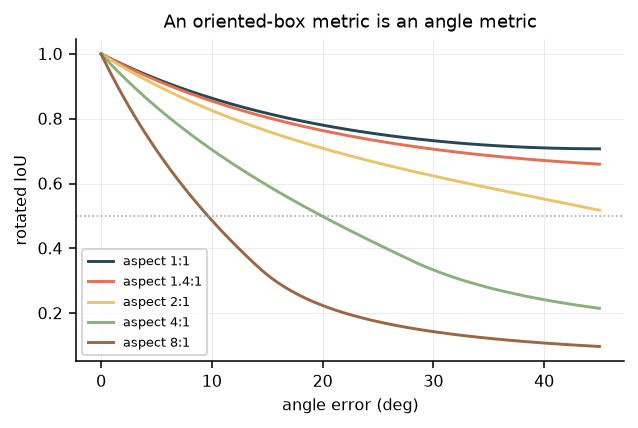

# Estimating Fetal Cardiac Orientation: Experiments and Failure Analysis

Technical companion to the [README](../README.md). The README covers *what was built*; this covers *what the experiments revealed*. Each is written as **Question → Method → Result → Interpretation**.

---

## 1. The problem

Given a four-chamber fetal ultrasound image, estimate the orientation `θ` of the heart's long axis. Three properties drive every design decision.

**The quantity is axial.** `θ` and `θ+180°` denote the same axis, so regression on `[0, 360)` puts a discontinuity inside the label space. Everything here uses the doubled-angle encoding `z(θ) = (sin 2θ, cos 2θ)`, continuous across the wrap, with circular statistics for aggregation.

**Direction is a separate problem.** Apex-left versus apex-right is levocardia versus dextrocardia — a diagnosis needing the spine or stomach bubble, not a cropped heart. The system reports an axis and abstains from the sign.

**Fetal lie is arbitrary.** No canonical orientation exists in the image, so rotation is a physically legitimate augmentation and rotation *equivariance* is a property the estimator must satisfy — which makes it testable without labels (§6).

The organising question: **must the orientation be learned at all?**

---

## 2. Data, and checking it first

**FOCUS** (Zenodo `10.5281/zenodo.14597550`, CC-BY-4.0): 300 four-chamber images, 200/50/50, each with an ellipse, an oriented box and a mask, for `cardiac` and `thorax`.
**FETAL_PLANES_DB** (Zenodo `10.5281/zenodo.3904280`, CC-BY-4.0): 12,400 images, 1,718 of the thorax plane, with the ultrasound machine recorded per image. Used only as an unlabelled external set.

> **Q.** The ellipse angle is about to become ground truth for the whole project. Is it trustworthy?
> **M.** Reconstruct centre, semi-major length and long-edge direction from the *independently stored* oriented-box corners; compare against the ellipse parameters over all 200 training images.
> **R.** Centre agrees to 0.071 px, semi-major to 0.085 px, angle to **0.033°** (max).
> **I.** Trustworthy. The check also pinned the convention — `a` is the semi-major axis, `theta` its direction in image coordinates with **y pointing down** — which, if assumed rather than verified, would have silently mirrored every angle in the project.

Detection is not the interesting part and is reported once: YOLOv5s fine-tuned on 200 images reaches mAP@50 **0.995** and recall **1.000** on both classes, 14 ms/image. One organ, one view, centred, always present. Its only informative test is the cross-dataset firing rate in §7.

---

## 3. Orientation without training

Two closed-form estimators operate on a mask with no training at all: the leading eigenvector of the pixel covariance (**second-order moments**), and the **minimum-area enclosing rectangle** via rotating calipers on the convex hull.

> **Q.** Can orientation be recovered without training an orientation model?
> **M.** Run both on the ground-truth cardiac masks; compare against the annotated angle.
> **R.**
>
> | Estimator | median | p90 | > 10° |
> |---|---|---|---|
> | second-order moments | **0.28°** | 0.45° | 0 % |
> | minimum-area rectangle | 4.95° | 88.42° | **44 %** |
>
> **I.** Moments are extremely accurate on clean masks. The minimum-area failures are not noise: for an ellipse the enclosing rectangle has area `4√(a²c²+b²s²)·√(a²s²+b²c²)`, attaining the same minimum `4ab` at **both** the major and the minor alignment. It is genuinely bimodal, picking one of two optima 90° apart. Exact for *area*, unstable for *axis*.
>
> **Caveat.** The FOCUS masks are rasterised from the same ellipse annotations, so 0.28° measures geometry-code consistency, not accuracy on a real segmenter. §4 is the experiment that carries information.

---

## 4. How good does the mask have to be?

> **Q.** If an existing pipeline supplies the mask, what mask quality is required?
> **M.** Degrade ground-truth masks in four parameterised ways modelling how segmenters fail — morphological erosion and dilation, a smooth random field on the contour, a wedge removed, an extra component added. Score each by Dice; measure the angle error with and without a two-line cleanup (largest connected component, then morphological opening).
> **R.**
>
> | Failure mode | Dice | raw | after cleanup |
> |---|---|---|---|
> | erosion | 0.77 | 0.22° | **0.22°** |
> | dilation | 0.82 | 0.40° | **0.40°** |
> | ragged contour | 0.66 | 40.20° | **1.72°** |
> | chunk missing | 0.83 | 20.87° | 21.13° |
> | adjacent tissue included | 0.87 | 46.21° | 44.73° |
>
> 
>
> **I.** Four conclusions, none of which follows from Dice.
>
> **Symmetric error is free** — eroding to Dice 0.77 costs 0.22°, because moments depend on how mass is distributed, not on how thick the mask is.
> **Cleanup is not optional** — it takes a ragged contour from 40.2° to **1.7°**.
> **Asymmetric mass survives cleanup** — a missing chunk (21°) or tissue leaking across a contiguous boundary (45°) cannot be removed by connected components, because the spurious mass is attached. This is the failure to look for in any real segmenter.
> **Dice does not predict the angle error** — 0.87 gives 46°, 0.77 gives 0.22°. "Our segmenter scores 0.9" is not an answer to "will the orientation be right".

---

## 5. The learned model, and two approaches that failed

When only a box is available, the moments have no mask and the angle must be learned. The model regresses four landmarks — the endpoints of the cardiac ellipse's axes — from which the angle and an oriented box are reconstructed. Architecture and loss are in the [README](../README.md#model-architecture); the load-bearing detail is the **swap-invariant coordinate loss**, because a 180° rotation exchanges both endpoint pairs at once, making two labellings equally correct and any fixed convention discontinuous.

Two architectural choices were selected by failure, not by prior belief.

> **Q.** Should landmarks be predicted as heatmaps, the standard formulation?
> **M.** Per-landmark Gaussian heatmaps at stride 4, with a soft-argmax coordinate head.
> **R.** Plateaued at **~28° median**, against 45° for chance on axial data.
> **I.** An ellipse axis endpoint has **no distinctive local appearance**: it is a point on a smooth boundary, defined by a *global* property of the shape, so a receptive field centred on it sees what it would see a few pixels along the contour. Heatmaps suit landmarks with local evidence — an apex, a valve hinge, a vertebral body — and not this. A second failure compounded it: soft-argmax over MSE-scale heatmaps gives a nearly uniform distribution, so the coordinate output collapses toward the crop centre while the heatmap loss keeps falling. A silent failure that looks like progress.

> **Q.** How should features be pooled before the regression heads?
> **M.** Global average pooling versus a 3×3 adaptive spatial grid, all else equal.
> **R.** GAP plateaued near **21°**; the 3×3 grid converged to **4.4°** on validation.
> **I.** Global average pooling is nearly orientation-invariant — it discards exactly the spatial layout that encodes the angle.

Sequence on the same split: **heatmaps 28° → global pooling 21° → spatial grid 4.4°.**

### In-distribution result

> **Q.** How accurate is the learned estimator, and how should that be described?
> **M.** 400-epoch checkpoint on the 50-image test split, ground-truth crops, so stage-1 error is excluded.
> **R.**
> ```
> median |error|   7.04°   95 % CI [4.84, 9.26]      p90  12.92°
> Bland-Altman     bias -0.55°   LoA [-18.23, +17.12]
> ICC(2,1)         0.980
> ```
> 
>
> **I.** Four numbers, four different things. *Bias −0.55°*: essentially unbiased, and a systematic offset is the failure a mean absolute error would hide. *ICC 0.980*: flattering, since cardiac angles span a wide range and ICC rewards tracking it. *LoA ±18°*: what a clinician would ask for, against a clinical normal band roughly 40° wide. *Validation 4.41° vs test 7.04°*: a real gap on 200 training images, and the bootstrap interval says the test estimate is itself loose. Training had not converged.
>
> Against §3, the learned route is roughly an order of magnitude worse. It exists only for the case where no mask is available.

> **Q.** Do the landmarks earn their place, or would a direct angle head do as well?
> **M.** The network already carries a second head predicting `(sin 2θ, cos 2θ)` directly on the same backbone. Evaluate both on the same test split.
> **R.** Landmarks 7.04° median; direct head **5.64°**. Their absolute errors correlate at **r = +0.79**.
> **I.** The direct head is marginally *better*, so landmarks are not justified by accuracy. They are justified by what a scalar cannot provide: an output a reviewer can reject point by point, an oriented box and aspect ratio for free, and two votes whose disagreement is a confidence signal. The r = +0.79 is the other half of the story — the heads share a backbone and tend to fail together, which is exactly why head disagreement is a weak abstention signal in §9, and an argument for a genuinely independent second estimator rather than a second head.

Stratified, the size effect dominates the shape effect: 9.26° at 90–120 px semi-major versus 4.93° above 120 px, against 6.70° / 7.93° across roundness bands. A few pixels of landmark error is several degrees on a small heart.

---

## 6. Validating where there are no labels

> **Q.** Can the estimator be validated without ground truth?
> **M.** Assert four properties that hold on any image: rotate by δ and the axis moves by δ; mirror and it reflects; change gain and it does not move; widen the crop and it does not move. Expected values are computed from the actual warp matrix, so the test carries no coordinate convention of its own.
> **R.**
> ```
> rotation ±15°   median 2.9–3.6°   p90  7.4–9.0°
> rotation ±30°   median 3.7–4.7°   p90 10.0–12.5°
> mirror          median 2.55°      p90 12.00°
> gain            median 0.74°      p90  3.90°   max 5.31°
> crop scale      median 3.65°      p90  8.63°
> ```
> All fail the tolerances set in the file. The tolerances were not relaxed.
>
> **I.** Rotation self-consistency (3–5°) is the same order as the model's own test error, so the residual is model variance rather than a coordinate bug. **Gain invariance is violated by up to 5°** — a pure brightness change moving an anatomical measurement. A concrete defect, localised with zero annotation.

The suite justified itself twice in ways a held-out set could not. Its first run reported errors of *exactly* twice the applied rotation on every image — the signature of a flipped sign, which was in the test's own expected value. And run against a deliberately undertrained checkpoint it returns errors of almost exactly δ: the signature of a model predicting a near-constant angle regardless of input. Detecting "the model ignores the image" without labels is what a deployment monitor has to do.

---

## 7. Cross-dataset validation

> **Q.** Does the model transfer to a different hospital and different machines, where no orientation labels exist?
> **M.** Run the detector and the same property tests on 500 images sampled from FETAL_PLANES_DB's thorax plane, stratified by ultrasound machine. Never trained on.
> **R.** Detector fires on **93 %** at mean confidence 0.75.
>
> | Property | median: FOCUS → external | p90: FOCUS → external |
> |---|---|---|
> | rotation ±15° | 2.9–3.6° → 3.9–4.3° | 7.4–9.0° → **20.5–21.9°** |
> | rotation ±30° | 3.7–4.7° → 5.3–6.5° | 10.0–12.5° → **29.2–39.6°** |
> | mirror | 2.6° → 6.5° | 12.0° → **44.3°** |
> | gain | 0.7° → 2.0° | 3.9° → 8.0° |
> | crop scale | 3.7° → **11.8°** | 8.6° → **44.0°** |
>
> By machine: 95 % firing on Voluson E6, **81 % on Aloka** at the lowest confidence of the four. Aloka is 41 % of the external set and appears nowhere in FOCUS.
>
> 
>
> **I.** The medians move modestly; the tails triple. The model works on typical external images and fails outright on a minority — a distinction any mean-based summary erases. Crop-scale sensitivity rising from 3.7° to 11.8° indicates the model partly learned the FOCUS crop convention rather than the anatomy: a training-time fix, not a data problem.
>
> Contrast with §3: the closed-form estimator **has no distribution to be out of**. Same arithmetic on any mask from any machine, with failure modes that are geometric and enumerable. That asymmetry, more than the accuracy gap, is the argument for reading the angle off a segmentation whenever one exists.

---

## 8. Closing the loop: composing the stages

> **Q.** Every test so far examines one stage on ground-truth inputs. Does the *composed* pipeline hold together?
>
> **M.** Run the deployed path and feed it back into itself: detect, estimate θ, rotate the full image so the heart is axis-aligned, detect again, estimate again. If the first estimate were exact the second must read zero, so the residual measures the whole system with no labels. A control run warps by a *random* angle instead, which verifies the warp algebra independently of the model — if the control fails, the measurement is broken rather than the network.
>
> **R.** Re-detection after de-rotation, stratified by the rotation actually applied:
>
> | applied \|rotation\| | 0–30° | 30–45° | 45–70° | 70–91° |
> |---|---|---|---|---|
> | `degrees: 30` (original) | 100 % | 100 % | **24 %** | **0 %** |
> | `degrees: 180` (corrected) | 100 % | 100 % | **100 %** | **100 %** |
>
> Point-biserial correlation between applied rotation and re-detection, before the fix: **r = −0.75**. Overall re-detection 52 % → **100 %**; re-detected centre displacement 12.5 px → 7.4 px. Cardiac mAP@50 moves 0.995 → 0.985.
>
> **I.** The detector was augmented over ±30° and the orientation model over ±180°. Each is defensible in isolation, and a heart at 45–135° needs up to 90° of rotation to be de-rotated — so the pipeline routinely asked stage 1 for something it had never seen. Not a careless setting: a **design-reasoning gap**, in which each stage's augmentation was chosen without deriving what the stage downstream would demand. It is invisible to unit tests by construction, because it exists only in the seam.

Three secondary observations, each of which would have been easy to report wrongly.

**The residual got worse after the fix**, 8.64° → 12.80° median. It is not a regression. Before the fix the residual could only be computed on the 52 % that re-detected — the easy, low-rotation cases — and repairing re-detection returned the hard cases to the sample. A metric degrading because the population got harder is a trap worth catching before publication.

**The control gives stage attribution for free.** The control warps by a random angle and measures from the known box: 4.36° median residual, against 12.80° for the round trip, which measures from the *re-detected* box. The gap is what stage-1 localisation variance costs the final angle, and it says the orientation model is not the dominant error term in the composed system.

**The test needed debugging before it could debug the model.** Its first version re-detected on the tight 192 px crop and reported 10 % — measuring the scale and context shift rather than rotation, since the detector was trained on hearts inside a full scene. Rotating the full image made rotation the only variable.

> ⚠️ **Necessary, not sufficient.** A constant-zero estimator passes this test trivially: de-rotating by zero is the identity. The round trip is meaningful only alongside rotation equivariance (§6), which a constant predictor fails by construction. A test named `test_roundtrip_is_trivially_passed_by_a_constant_estimator` exists to keep that limitation visible in the code rather than only in prose.

---

## 9. What the oriented box is worth

> **Q.** What does collapsing the oriented annotation to axis-aligned cost, and what does the orientation head recover?
> **M.** Area ratio between each oriented box's enclosing axis-aligned box and the oriented box, across all 300 images, against orientation. Rotated IoU (convex-polygon intersection) of the annotation against both the predicted oriented box and the axis-aligned box.
> **R.** Median area ratio **×1.97** (above ×1.5 on 83 % of cases). Median rotated IoU **0.83** for the predicted oriented box, **0.51** for the axis-aligned box.
>
> 
>
> **I.** The points follow the analytic curve `(|cos θ| + k|sin θ|)(|sin θ| + k|cos θ|)/k` for mean aspect ratio `k = 0.73`, zero-cost at 0° and 90° and peaking at 45°. **The annotations cluster at 45° and 135°** — where a fetal heart sits in a correct four-chamber view — so the near-worst case is the ordinary case. The axis-aligned box lands at 0.51 IoU, right on the threshold most detection benchmarks use to count a box as correct.

A consequence for metric choice: rotated IoU decays with angle error at a rate set entirely by aspect ratio. At 1:1 the angle is meaningless and IoU barely moves; at 4:1 a 20° error breaks the 0.5 threshold; at 8:1 10° is nearly fatal. A fetal heart is around 1.4:1, so **mAP looks forgiving and hides exactly the quantity of interest** — hence angle error is reported directly.



---

## 10. Confidence, tested rather than assumed

> **Q.** Does the eigengap standard error of the PCA estimator identify unreliable predictions?
> **M.** Correlate `Var(θ) ≈ λ₁λ₂/(λ₁−λ₂)²/n` against actual angle error across every corruption in §4.
> **R.** **r = +0.03.**
> **I.** It fails, for an instructive reason: spurious attached mass increases the spread along one direction, **widening** the eigengap. The estimator becomes more confident as it becomes wrong. A theoretically motivated uncertainty is a hypothesis until measured.

> **Q.** Do the learned model's internal consistency signals support abstention?
> **M.** Risk–coverage curves for head disagreement, axis-vote disagreement, predicted elongation and heart size, against an oracle.
> **R.** Dropping to 53 % coverage moves the median from 7.04° to 5.40°; the p90 barely moves. The best signal is simply **heart size**, and predicted elongation is *worse than nothing* — abstaining by it raises the median error.
> 
> **I.** A confidence signal that does not reduce error is not a confidence signal. `predict.py` still exposes `assessable`, because the roundness condition is geometrically sound and the rule is the right shape, but the honest summary is that this model does not yet know when it is wrong.

---

## 11. Limitations

- **Not the clinical cardiac axis.** That is measured against the thoracic spine-to-sternum midline; FOCUS annotates neither spine nor septum. `geometry.cardiac_axis()` needs one additional landmark.
- **±18° limits of agreement are not clinically useful** against a ~40°-wide normal band.
- **External evaluation covers self-consistency, not accuracy** — no orientation labels exist outside FOCUS.
- **The segmentation-failure study is simulated**, modelling failure rather than sampling a real segmenter.
- **No human reader ceiling**, so 7° has no reference point.
- **300 training images, one source**, no gestational-age stratification.
- **The 0.28° figure is a floor**, since those masks derive from the same annotations.
- **Not a medical device. No clinical validation.**

---

## 12. Conclusions

**Orientation does not have to be learned.** Where a segmentation exists, second-order moments recover the axis analytically, two orders of magnitude more accurately than the trained model, with no distribution to be out of and with failure modes that are geometric and enumerable. The learned landmark model earns its place only when a detector returns a box and no mask.

**The most useful findings needed no labels.** The gain-invariance violation, the crop-scale shortcut and the external tail degradation all came from property tests that transfer to any dataset and keep working after deployment. Two more — the heatmap failure and the pooling failure — came from experiments that returned negative results and thereby selected the architecture.

**The only defect found rather than characterised came from composing the stages.** Detector and orientation model each passed their own tests while the pipeline asked the detector for rotations it had never been trained on. Unit-level testing cannot see a seam.

**Several things that should have worked did not.** A theoretically motivated uncertainty correlated with error at r = +0.03, and the model's own consistency signals bought almost no accuracy through abstention. Both are reported rather than dropped: a pipeline that cannot tell when it is wrong is a different product from one that can, and the difference is only visible if measured.

**Next:** annotate one spine landmark to reach the clinical quantity and measure both error terms separately; establish the reader ceiling; repeat §4 against a real segmenter's masks; fix the crop-scale and gain sensitivities; and evaluate the decision (abnormal axis at the cut-off) rather than the angle, since a 3° error is irrelevant mid-band and decisive at the boundary.

---

```bash
git clone https://github.com/francescovigni/fetal-cardiac-orientation.git
cd fetal-cardiac-orientation && python3 -m venv .venv
.venv/bin/pip install -r requirements.txt
make data test baselines no-training     # closed-form route, no GPU
make yolo train eval meta figures        # learned route
make data-external external              # cross-dataset run
```

Data: *FOCUS*, Zenodo `10.5281/zenodo.14597550`; Burgos-Artizzu et al., *FETAL_PLANES_DB*, Zenodo `10.5281/zenodo.3904280`. Both CC-BY-4.0. Code MIT.
